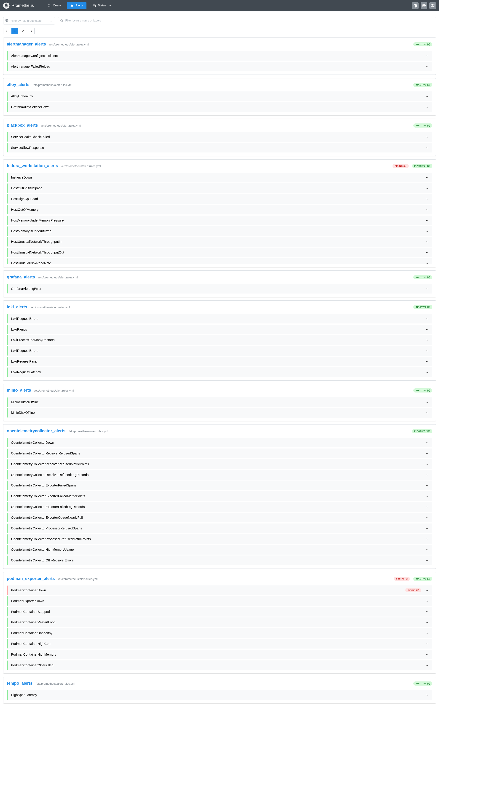

# Full Stack monitoring met Prometheus, Loki, Tempo en Grafana
## Fedora Workstation & Podman Rootless

Deze repository bevat een complete, Cloud Native Observability Stack die speciaal is geoptimaliseerd voor Fedora Workstation met Rootless Podman. De stack combineert metrics, logs en traces in één geïntegreerde omgeving met Grafana.

## Features

-   Metrics: Prometheus (v3.9) met Node Exporter & Podman Exporter.
-   Logs: Grafana Loki (v3.3) met opslag op MinIO (S3).
-   Traces: Grafana Tempo (v2.6) met OpenTelemetry ondersteuning.
-   Grafana: (v12.3) als frontend voor metrics, logging en tracing. Grafana Dashboards en Datasources worden automatisch geladen (IaC).
-   Collection: Grafana Alloy en Opentelemetry collector voor het verzamelen van journald logs.
-   Storage: MinIO (S3 compatible) voor langdurige, efficiënte opslag van logs en traces.
-   Alerting: Prometheus Alertmanager gekoppeld aan Karma (dashboard) en Blackbox Exporter (health checks).
-   Karma: Dashboard voor alerts.
-   Security: Volledig compatible met SELinux en draait Rootless (met specifieke fixes voor socket-toegang).
-   webhook-tester: ontvangt alerts van alertmanager voor inspectie.

## Architectuur

De stack bestaat uit de volgende services:

| Service         | Poort | Beschrijving                                     | 
|-----------------|-------|--------------------------------------------------|
| Grafana         | 3000  | Dashboard en visualisatie.                       |
| Prometheus      | 9090  | Time-series database voor metrics.               |
| Alertmanager    | 9093  | Verwerkt en routeert alerts.                     |
| Karma           | 8080  | UI Dashboard voor Alertmanager meldingen.        |
| Loki            | 3100  | Log aggregatie (via MinIO S3).                   |
| Tempo           | 3200  | Distributed Tracing backend (via MinIO S3).      |
| MinIO           | 9000  | S3 Object Storage API.                           |
| MinIO Console   | 9001  | Webinterface voor storage beheer.                |
| Alloy           | 12345 | Collector voor logs (journald) en traces (OTEL). |
| Blackbox        | 9115  | Uitvoeren van HTTP/TCP health probes.            |
| Node-exporter   | 9100  | Host metrics collector.                          |
| podman-exporter | 9882  | podman metrics collector.                        |
| OpenTelemetry   | 8888  | Open Telemetry Collector.                        |
| webhook-tester  | 5001  | Webhooks inspectie.                              |

## Prerequisites

-   OS: Fedora Linux (getest op Fedora 43+).
-   Tools: podman en podman-compose.
-   Podman Socket: De user-socket moet actief zijn voor de Podman Exporter en Alloy.

```bash
# Installeer benodigdheden\
sudo dnf install podman podman-compose -y

# Activeer de Podman socket voor je gebruiker (Rootless)\
systemctl --user enable --now podman.socket


# Check of de socket werkt
ls -l /run/user/$(id -u)/podman/podman.sock
```

## Installatie & Starten

1.  Clone de repository:
```bash
    git clone https://github.com/tedsluis/monitoring.git\
    cd monitoring
```
2.  Start de stack:
```bash
    podman-compose up -d
```
    
De eerste keer zal de `minio-init` container automatisch de benodigde buckets (`loki-data` en `tempo-data`) aanmaken.

3.  Controleer de status:
```bash
    podman ps
```

## Configuratie

De configuratie is opgedeeld in mappen per component. Dankzij Grafana Provisioning worden datasources automatisch ingeladen.

### Mappenstructuur

-   `alertmanager/`: Routing van notificaties.
-   `alloy/`: Pipeline configuratie voor het lezen van journald en de podman.socket.
-   `blackbox/`: Definities voor HTTP health checks.
-   `grafana-provisioning/`: Koppelt Prometheus, Loki en Tempo automatisch aan Grafana.
-   `grafana-provisioning/dashboards/json`: grafana dashboarden.
-   `grafana-provisioning/datasources`: automatisch datasource configiratie.
-   `loki/`: Configuratie voor Loki (S3 backend) en recording rules.
-   `otel`: opentelemetry configuratie.
-   `prometheus/`: prometheus.yml en alert.rules.yml.
-   `tempo/`: Configuratie voor Tempo (S3 backend).

### Inloggegevens (Defaults)

| Service | Gebruikersnaam | Wachtwoord | Opmerking                   |
|---------|----------------|------------|-----------------------------|
| Grafana | admin          | admin      | Wijzig dit na eerste login! |
| MinIO   | minio          | minio123   | Beheer via poort 9001.      |

## Gebruik


### 1. Dashboards (Grafana)

Ga naar http://localhost:3000.

#### Dashboards

[./monitoring/grafana-provisioning/dashboards/json/](./grafana-provisioning/dashboards/json/)


#### Explore

Loki explore


Metrics explore


Tracing explore


#### Drildown

Metrics drilldown


Loki drildown


#### Grafana alerts


#### Grafana datasources

[./monitoring/grafana-provisioning/dashboards/dashboard.yaml](./grafana-provisioning/datasources/datasources.yaml)

### 2. Prometheus Metrics

Ga naar http://localhost:9090

- `/query`:  metrics querier.
- `/alerts`: alert rule overzicht
- `/targets`: status van de scrape targets.
- `/config`: volledige prometheus configuratie.



### 3. Alertmanager

Ga naar http://localhost:9093


- Overzicht van actuele alerts
- Mogelijkheid om alerts te dempen.

### 4. Karma Alert Dashboard

Ga naar http://localhost:8080.

Hier zie je een overzicht van alle actieve waarschuwingen (bijv. "Disk bijna vol", "Container down" of "Health Check Failed").


### 5. Storage (MinIO)

Ga naar http://localhost:9001.


Hier kun je zien hoeveel data Loki en Tempo verbruiken in hun buckets.

### 6. webhook-tester

Alertmanager stuurt de alert door naar de webhook-tester


### 7. Alloy exporter

http://localhost:12345/

### 8. Blackbox exporter

http://localhost:9115/

Blackbox dashboard


### 9. Loki

Loki dashboard


### 10. node-exporter

nodes-exporter-full


### 11. podman-exporter

podman-exporter


## Troubleshooting

-   Permission Denied op volumes?\
    De containers (o.a. MinIO, Loki, Tempo) draaien met user: "0:0". In Rootless Podman wordt dit gemapt naar jouw eigen user ID (1000). Dit is noodzakelijk voor schrijfrechten.\
    Fix: Voer podman unshare chown -R 1000:1000 . uit in de map als rechten corrupt zijn geraakt.

-   Geen logs in Loki?\
    Check of Alloy draait en of de journald mounts correct zijn. Alloy vereist security_opt: label=disable om /var/log/journal van de host te kunnen lezen.

-   MinIO start niet?\
    Als je wisselt tussen rootful/rootless kan het volume gelocked zijn. Verwijder het volume met podman volume rm monitoring_minio-data en herstart.

