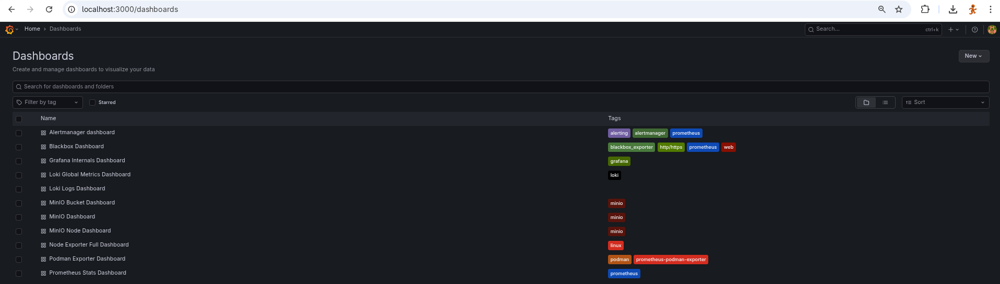
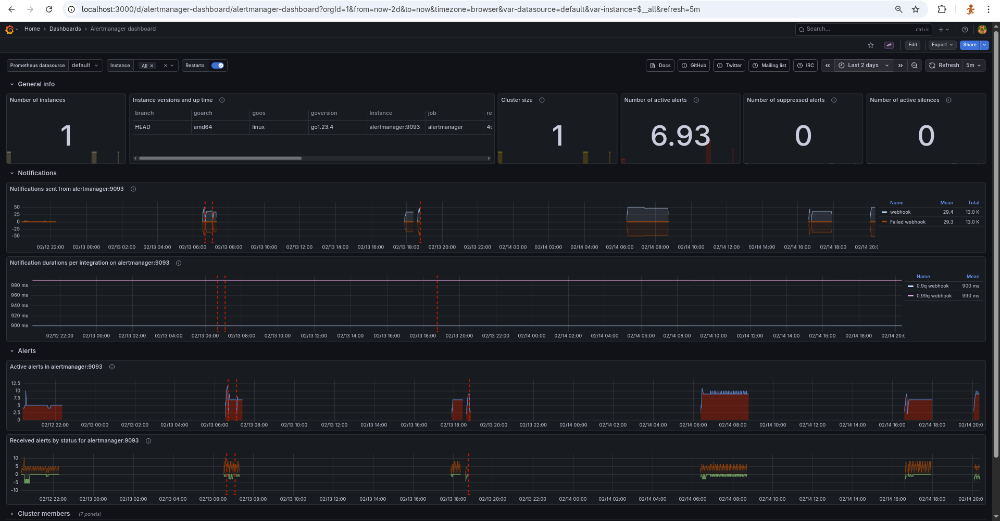
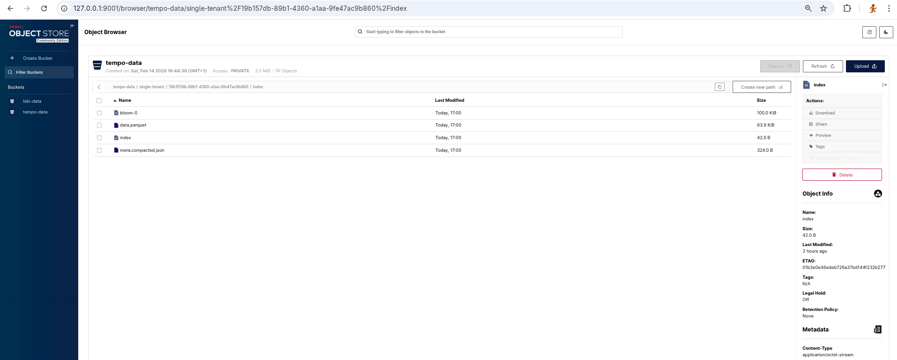
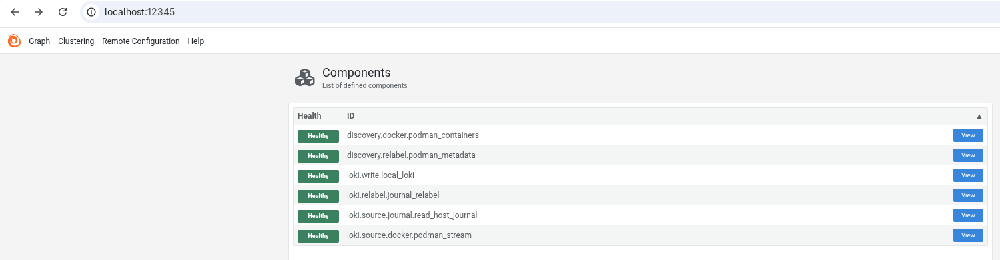
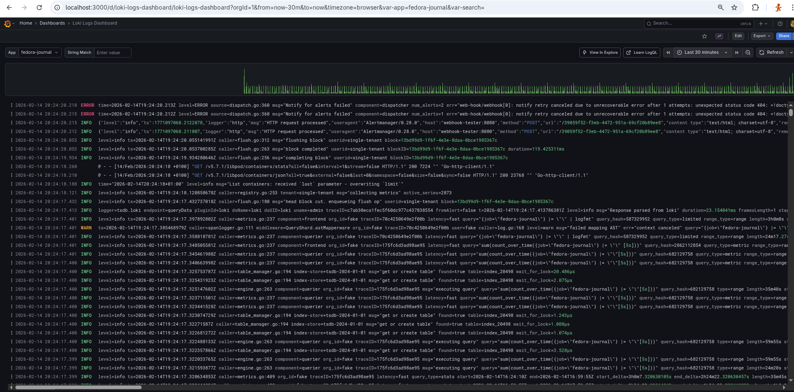

# Full Stack monitoring met Prometheus, Loki, Tempo en Grafana
## Fedora Workstation & Podman Rootless

Deze repository bevat een complete Observability, geoptimaliseerd voor Fedora Workstation met Rootless Podman. De stack combineert metrics, logs en traces in één geïntegreerde omgeving met Grafana als frontend.

## Features

-   Metrics: Prometheus (v3.9) met Node Exporter & Podman Exporter.
-   Logs: Grafana Loki (v3.3) met opslag op MinIO (S3).
-   Traces: Grafana Tempo (v2.10) in combinatie met OpenTelemetry.
-   Grafana: (v12.3) als frontend voor metrics, logging en tracing. 
-   Grafana Dashboards en Datasources worden automatisch geladen (IaC).
-   Collection: Alloy en Opentelemetry collector voor het verzamelen van container en journald logs.
-   Storage: MinIO (S3 compatible) voor langdurige, efficiënte opslag van logs en traces.
-   Alerting: Prometheus Alertmanager gekoppeld aan Karma (alert dashboard) en Blackbox Exporter (health checks).
-   Karma: Dashboard voor alerts.
-   Security: Volledig compatible met SELinux en draait Rootless (met specifieke fixes voor socket-toegang).
-   webhook-tester: ontvangt alerts van alertmanager voor inspectie.

## Architectuur

De stack bestaat uit de volgende services:

| Service           | Poort | Beschrijving                                     | 
|-------------------|-------|--------------------------------------------------|
| Alertmanager      |  9093 | Verwerkt en routeert alerts.                     |
| Alloy             | 12345 | Collector voor logs (journald en podman logs).   |
| Blackbox          |  9115 | Uitvoeren van HTTP/TCP health probes.            |
| Grafana           |  3000 | Dashboards en visualisatie.                      |
| Karma             |  8080 | UI Dashboard voor Alertmanager meldingen.        |
| Loki              |  3100 | Log aggregatie (via MinIO S3).                   |
| MinIO             |  9000 | S3 Object Storage API.                           |
| MinIO Console     |  9001 | Webinterface voor storage beheer.                |
| NGINX             |    80 | Startpagina.                                     |
| Node-exporter     |  9100 | Host metrics collector.                          |
| OpenTelemetry     |  8888 | Open Telemetry Collector.                        |
| podman-exporter   |  9882 | podman metrics collector.                        |
| Prometheus        |  9090 | Time-series database voor metrics.               |
| Tempo             |  3200 | Distributed Tracing backend (via MinIO S3).      |
| Traefik           |   443 | Reverse proxy.                                   |
| webhook-tester    |  5001 | Webhooks inspectie.                              |

Diagram


## Prerequisites

-   OS: Fedora Linux (getest op Fedora 43+).
-   Tools: podman en podman-compose.
-   Podman Socket: De user-socket moet actief zijn voor de Podman Exporter en Alloy.

```bash
# Installeer benodigdheden\
sudo dnf install podman podman-compose -y

# Activeer de Podman socket voor je gebruiker (Rootless)\
systemctl --user enable --now podman.socket

# Check of de socket werkt
ls -l /run/user/$(id -u)/podman/podman.sock

# Maak het gebruik van port 80 mogelijk
sudo sysctl -w net.ipv4.ip_unprivileged_port_start=80
net.ipv4.ip_unprivileged_port_start = 80
echo "net.ipv4.ip_unprivileged_port_start=80" | sudo tee /etc/sysctl.d/99-rootless-ports.conf
net.ipv4.ip_unprivileged_port_start=80
```

## Installatie & Starten

1.  Clone de repository:
```bash
    git clone https://github.com/tedsluis/monitoring.git\
    cd monitoring
```

2.  Start de stack:
```bash
    podman-compose up -d
```
De eerste keer zal de `minio-init` container automatisch de benodigde buckets (`loki-data` en `tempo-data`) aanmaken.

3. certificaat maken en CA trusten
```bash
$ ./renew-certs.sh 
=== Start Certificaat Vernieuwing (Versie 3.2) ===
Opruimen oude bestanden...
Genereren SAN configuratie...
Genereren Root CA...
.........+........+.+...+...+...+...........+.+++++++++++++++++++++++++++++++++++++++*................+.....+.+.....+...+....+...+.....+++++++++++++++++++++++++++++++++++++++*.....+.....+...+.............+.....++++++
.........+++++++++++++++++++++++++++++++++++++++*....+...+..+++++++++++++++++++++++++++++++++++++++*..+..................+..+...+.........+...+...+...+.......+........+......+....+.........+.....+.............+........+.+......+.........+..............+.+.....+................+...+.....+....+..+...++++++
-----
Genereren Server Certificaat...
Certificate request self-signature ok
subject=C=NL, ST=Utrecht, L=Utrecht, O=Bachstraat, OU=Home, CN=*.localhost
Permissies corrigeren (chmod 644)...
Bijwerken Fedora Trust Store...
Controleren of System Bundle het certificaat vertrouwt...
✓ SUCCES: Systeem bundel vertrouwt nu je certificaat!
Traefik herstarten...
traefik
traefik
f440114ea928262e964b7dddeded7e2dbbcc3f5cb2047c5c5f71033a51d3a2d3
traefik
=== Klaar! ===
Test nu met: curl -v https://grafana.localhost
```
    
4.  Controleer de status:
```bash
    podman ps -a

    CONTAINER ID  IMAGE                                                   COMMAND               CREATED        STATUS                    PORTS                                                             NAMES
    f524a3ca328f  docker.io/library/traefik:v3.6.8                        traefik               3 minutes ago  Up 3 minutes              0.0.0.0:80->80/tcp, 0.0.0.0:443->443/tcp, 0.0.0.0:4317->4317/tcp  traefik
    43b51e82de7f  docker.io/minio/minio:latest                            server /data --co...  3 minutes ago  Up 3 minutes (healthy)    9000/tcp                                                          minio
    b6cb71d79258  quay.io/prometheus/node-exporter:v1.10.0                --path.rootfs=/ho...  3 minutes ago  Up 3 minutes              9100/tcp                                                          node-exporter
    9bb655a1256a  quay.io/navidys/prometheus-podman-exporter:latest                             3 minutes ago  Up 3 minutes              9882/tcp                                                          podman-exporter
    1639e991fd9b  quay.io/prometheus/prometheus:v3.9.0                    --config.file=/et...  3 minutes ago  Up 3 minutes              9090/tcp                                                          prometheus
    0ad72220502a  quay.io/prometheus/alertmanager:v0.28.0                 --config.file=/et...  3 minutes ago  Up 3 minutes              9093/tcp                                                          alertmanager
    5c7d100a08b9  docker.io/grafana/alloy:latest                          run --server.http...  3 minutes ago  Up 3 minutes                                                                                alloy
    631dbae21d7b  quay.io/prometheus/blackbox-exporter:latest             --config.file=/co...  3 minutes ago  Up 3 minutes              9115/tcp                                                          blackbox-exporter
    061ff5c11526  docker.io/tarampampam/webhook-tester:latest             start                 3 minutes ago  Up 3 minutes                                                                                webhook-tester
    d407d0a9d78a  docker.io/library/nginx:alpine                          nginx -g daemon o...  3 minutes ago  Up 3 minutes              80/tcp                                                            startpagina
    09aae3a22f00  docker.io/minio/mc:latest                                                     3 minutes ago  Exited (0) 3 minutes ago                                                                    minio-init
    237d4ad33122  ghcr.io/prymitive/karma:latest                                                3 minutes ago  Up 3 minutes              8080/tcp                                                          karma
    1eb506abaf76  docker.io/grafana/loki:3.3.2                            -config.file=/etc...  3 minutes ago  Up 3 minutes              3100/tcp                                                          loki
    725f28f5ede0  docker.io/grafana/tempo:2.6.1                           -config.file=/etc...  3 minutes ago  Up 3 minutes                                                                                tempo
    3ca266a019d6  docker.io/otel/opentelemetry-collector-contrib:0.119.0  --config=/etc/ote...  3 minutes ago  Up 3 minutes              4317-4318/tcp, 55678-55679/tcp                                    otel-collector
    81bc654217d5  docker.io/grafana/grafana:12.3.0                                              3 minutes ago  Up 3 minutes              3000/tcp                                                          grafana
```
note: De minio-init container draait alleen bij het starten van minio.

## Stoppen, starten of herstart

```bash
podman-compose down

podman-compose up -d

podman-compose down && podman-compose up -d

podman-compose up -d --force-recreate webhook-tester

podman restart webhook-tester
```

## Configuratie

De configuratie is opgedeeld in mappen per component. Dankzij Grafana Provisioning worden datasources automatisch ingeladen.

### Mappenstructuur

-   `alertmanager/`: Routing van notificaties.
-   `alloy/`: Pipeline configuratie voor het lezen van journald en de podman.socket.
-   `blackbox/`: Definities voor HTTP health checks.
-   `grafana-provisioning/`: Koppelt Prometheus, Loki en Tempo automatisch aan Grafana.
-   `grafana-provisioning/dashboards/json`: grafana dashboarden.
-   `grafana-provisioning/datasources`: automatisch datasource configiratie.
-   `loki/`: Configuratie voor Loki (S3 backend) en recording rules.
-   `otel`: opentelemetry configuratie.
-   `prometheus/`: prometheus.yml en alert.rules.yml.
-   `tempo/`: Configuratie voor Tempo (S3 backend).

### Inloggegevens (Defaults)

| Service | Gebruikersnaam | Wachtwoord | Opmerking                             |
|---------|----------------|------------|---------------------------------------|
| Grafana | admin          | admin      | Deze kun je wijzigen na eerste login! |
| MinIO   | minio          | minio123   | Beheer via poort 9001.                |

## Gebruik

### 1. Dashboards (Grafana)

Ga naar https://grafana.localhost

Grafana vormt het centrale, visuele hart van deze observability stack en fungeert als 'single pane of glass' voor al je data. Het open-source platform verbindt naadloos met Prometheus (metrics), Loki (logs) en Tempo (traces), waardoor je via interactieve dashboards en de krachtige Explore-modus diepgaand inzicht krijgt in de prestaties van je systeem. Dankzij de geautomatiseerde provisioning worden de datasources en dashboards direct bij het opstarten ingeladen, zodat je zonder handmatige configuratie direct aan de slag kunt met het analyseren en correleren van je monitoringgegevens.

#### Dashboards

Deze repo bevat een aantal grafana dashboarden die opgeslagen zijn in [./grafana-provisioning/dashboards/json/](./grafana-provisioning/dashboards/json/) in json formaat.

Grafana Dashboards


#### Explore

De Explore-modus biedt een geavanceerde interface voor ad-hoc analyse en troubleshooting, waarbij gebruikers direct query's kunnen uitvoeren. Hiermee faciliteert Explore snelle incidentdiagnose en root-cause analyse, zonder de noodzaak om vooraf gedefinieerde dashboards te configureren.

**Loki logs explore**

 De Loki-datasource in combinatie met LogQ maakt het mogelijk om logstromen efficiënt te filteren op labels, specifieke tekstpatronen of reguliere expressies te doorzoeken en logvolumes visueel weer te geven naast de ruwe logregels. 


**Prometheus metrics explore**

De Prometheus-datasource biedt in combinatie met PromQL-queries de mogelijk om het iteratief onderzoeken van time-series data, het visualiseren van trends en het vergelijken van metrieken via split-view functionaliteit.


**Tempo tracing explore**

De Tempo-datasource in combinatie TraceQL biedt een gedetailleerde visualisatie van de levenscyclus van requests door de gedistribueerde architectuur. Via de waterfall-weergave kunnen gebruikers de latency per component analyseren, waardoor performance-bottlenecks en fouten binnen specifieke spans nauwkeurig kunnen worden geïsoleerd. De integratie met TraceQL maakt gerichte filtering van traces mogelijk, wat in combinatie met gecorreleerde logs en metrics zorgt voor een efficiënte analyse van de hoofdoorzaak bij incidenten. Het kan bijvoorbeeld interesant zijn om te filteren op request niet een http status code van 4xx of 5xx hebben. Of request die langer duren dan 500ms.


#### Drilldown

De drill-down functionaliteit binnen Grafana biedt de mogelijkheid om diepgaande foutanalyse door metrics, logs en traces contextueel met elkaar te verbinden. Vanuit een anomalie in een metrics-dashboard kan je direct navigeren naar de gecorreleerde logregels in Loki, om vervolgens via automatisch gedetecteerde trace-ID's door te schakelen naar gedetailleerde request-spans in Tempo. Deze integratie elimineert de noodzaak om handmatig tijdstippen en identifiers te synchroniseren tussen verschillende datasources, wat de efficiëntie van root cause analysis en performance-optimalisatie aanzienlijk verhoogt.

Metrics drilldown


Loki drilldown


#### Grafana alerts

Grafana Alerting biedt een centrale interface voor het monitoren van alerts. Deze module aggregeert alert rules vanuit zowel Prometheus (voor metrics) als Loki (voor logdata), waardoor een overzicht ontstaat van de operationele status. Je kunt via dit dashboard de realtime status van alerts (‘Pending’ of ‘Firing’) analyseren, de onderliggende query-definities bekijken en inzicht verkrijgen in de evaluatiecriteria die de stabiliteit en beschikbaarheid van het platform bewaken.

Grafana Alerting


#### Grafana datasources

Datasources vormen binnen Grafana de technische interface naar de onderliggende data-opslagsystemen, waardoor de applicatie in staat is gegevens op te halen zonder deze zelf te persisteren. In deze configuratie zijn Prometheus, Loki en Tempo gedefinieerd als primaire bronnen voor het ontsluiten van respectievelijk metrics, logbestanden en distributed traces. 


De datasources voor Prometheus, Loki en Tempo zijn geconfigureerd in [./grafana-provisioning/dashboards/dashboard.yaml](./grafana-provisioning/datasources/datasources.yaml)


### 2. Prometheus Metrics

Ga naar https://prometheus.localhost

- `/query`:  metrics querier.
- `/alerts`: alert rule overzicht
- `/targets`: status van de scrape targets.
- `/config`: volledige prometheus configuratie.

Prometheus UI - alert rules overzich


Prometheus dashboard


### 3. Alertmanager

Ga naar https://alertmanager.localhost

Alertmanager UI


Alertmanager dashboard


- Overzicht van actuele alerts
- Mogelijkheid om alerts te dempen.

### 4. Karma Alert Dashboard

Ga naar https://karma.localhost

Hier zie je een overzicht van alle actieve waarschuwingen (bijv. "Disk bijna vol", "Container down" of "Health Check Failed").

Karma UI


### 5. Storage (MinIO)

Ga naar https://minio.localhost

Minio UI - login


Minio UI - object browser


Minio dashboard overview


Minio dashboard bucket


Hier kun je zien hoeveel data Loki en Tempo verbruiken in hun buckets.

### 6. webhook-tester

Ga naar https://webhook-tester.localhost

Alertmanager stuurt de alerts door naar de webhook-tester

Webhook-tester UI


### 7. Alloy exporter

https://alloy.localhost

Alloy UI


### 8. Blackbox exporter

https://blackbox.localhost

Blackbox dashboard


### 9. Loki

Loki dashboard


Loki logging dashboard


### 10. Tempo

Tempo dashboard


### 11. node-exporter

nodes-exporter-full


### 12. podman-exporter

podman-exporter


