# Full Stack Observability & Monitoring Platform
## An Educational Lab for Prometheus, Loki, Tempo, Grafana, and Alerting

This repository contains a complete, production-like observability stack optimized for Fedora Workstation with rootless Podman. It is designed as an educational environment to help Developers and DevOps Engineers understand how modern monitoring tools interlock to provide comprehensive metrics, logging, tracing, profiling and alerting capabilities. The entire stack is automatically configured upon startup, including pre-provisioned Grafana dashboards, datasources, and alerting rules.

Diagram


## Table of Contents

1. Educational Benefits
2. Architecture & Data Flow
3. Service Port Map
4. Tooling & Functionality
5. Installation & Startup
6. Additional scripts
7. Usage & Exploration (Screenshots)
8. Teardown & Cleanup

## 1. Educational Benefits

Why use this stack? This environment is built to teach you:

- **The four Pillars of Observability**: How to seamlessly connect Metrics (Prometheus), Logs (Loki), Traces (Tempo) and Profiles (Pyroscope).
- **Contextual Drill-down**: How to configure Grafana datasources so you can jump directly from a spike in a metric to the specific log line, then to the exact application trace and finally to the specific line of code causing the bottleneck via a Flame Graph.
- **Modern Collection**: Using Grafana Alloy and OpenTelemetry Collector as modern, vendor-neutral data pipelines.
- **S3-Compatible Storage**: How Loki and Tempo use MinIO object storage for scalable, long-term data retention instead of local disks.
- **Advanced Alerting Routing**: The flow of an alert from Prometheus -> Alertmanager -> KeepHQ / Karma / Webhook-tester.
- **Secure Local Networking**: Running a complex stack via Traefik Reverse Proxy with TLS/SSL on your own custom domain using rootless Podman.

## 2. Architecture & Data Flow

The stack is designed around specific data flows.
### 2.1 Metrics Flow

Node-exporter, Podman-exporter, and Blackbox-exporter expose metrics -> Prometheus scrapes them -> Grafana visualizes them.


### 2.2 Logging Flow

System (journald) and Container logs -> Grafana Alloy collects them -> Pushed to Loki -> Stored in MinIO -> Visualized in Grafana.


### 2.3 Tracing Flow

Application traces -> OpenTelemetry Collector -> Pushed to Tempo -> Stored in MinIO -> Visualized in Grafana.


### 2.4 Alerting Flow

Prometheus evaluates alert.rules.yml -> Fires to Alertmanager -> Alertmanager routes to Karma (UI), KeepHQ (AIOps), and Webhook-tester.


### 2.5 Profiling Flow

Monitoring tools (like Prometheus, Loki, Alloy) expose pprof endpoints -> Grafana Alloy scrapes these CPU and Memory profiles -> Pushed to Pyroscope -> Stored in MinIO -> Visualized as Flame Graphs in Grafana.

## 3. Service Port Map

| Service         | Internal Port | Public URL                          | Description                              |
|-----------------|---------------|-------------------------------------|------------------------------------------|
| Nginx           | 80            | https://localhost                   | Landing page portal                      |
| Traefik         | 443 / 8082    | https://traefik.localhost           | Reverse proxy & Ingress routing          |
| Grafana         | 3000          | https://grafana.localhost           | Main visualization & Dashboard UI        |
| Prometheus      | 9090          | https://prometheus.localhost        | Time-series database                     |
| Loki            | 3100          | https://loki.localhost              | Log aggregation engine                   |
| Tempo           | 3200          | https://tempo.localhost             | Distributed Tracing backend              |
| Pyroscope       | 4040          | https://pyroscope.localhost         | Continuous Profiling backend (flamegraph)|
| MinIO           | 9000 / 9001   | https://minio.localhost             | S3 Object Storage for Loki & Tempo       |
| Alloy           | 12345         | https://alloy.localhost             | Log collection pipeline                  |
| OTel Collector  | 4317 / 8888   | https://otel-collector.localhost    | Trace collection pipeline                |
| Alertmanager    | 9093          | https://alertmanager.localhost      | Alert routing and deduplication          |
| Karma           | 8080          | https://karma.localhost             | Alert visualization dashboard            |
| KeepHQ          | 3000 / 8080   | https://keep.localhost              | Open-source AIOps and alert management   |
| Webhook Tester  | 8080          | https://webhook-tester.localhost    | Endpoint for inspecting webhook payloads |
| node-exporter   | 9100          | https://node-exporter.localhost     | Host metrics                             |
| podman-exporter | 9882          | https://podman-exporter.localhost   | Container metrics                        |
| Blackbox        | 9115          | https://blackbox-exporter.localhost | HTTP/TCP endpoint probe                  |

**note:** Instead of `localhost` you can configure your own `DOMAIN` using the `.env` file.

## 4. Tooling & Functionality

**1. Visualization & Portal**
   * Nginx (Portal): Serves as a static, central hub linking to all services and endpoints.
   * Grafana: The 'single pane of glass'. Dashboards and Datasources are loaded automatically via Infrastructure as Code (IaC).

**2. Metrics (The "What is happening?")**
   * Prometheus: Scrapes targets, stores time-series data, and evaluates alert rules.
   * Exporters:
     * Node Exporter: Collects host hardware and OS metrics.
     * Podman Exporter: Collects metrics from rootless Podman containers.
     * Blackbox Exporter: Probes endpoints over HTTP/TCP to monitor uptime.

**3. Logging (The "Why is it happening?")**
   * Grafana Loki: Highly efficient log aggregation system. Uses MinIO for storage.
   * Grafana Alloy: The collector that reads journald and /var/run/podman.sock (Podman) and pushes logs to Loki.

**4. Tracing (The "Where is it happening?")**
   * Grafana Tempo: High-scale distributed tracing backend. Uses MinIO for storage.
   * OpenTelemetry (OTel) Collector: Receives OTLP traces and forwards them to Tempo.

**5. Profiling (The "Why is the code consuming resources?")**
   * Grafana Pyroscope: Continuous profiling backend. Analyzes performance profiles to identify CPU and memory bottlenecks. Uses MinIO for storage.
   * Grafana Alloy: Scrapes pprof endpoints from running containers and sends them to Pyroscope.

**5. Storage & Infrastructure**
   * MinIO: S3-compatible storage providing scalable object storage for Tempo, Loki and Pyroscope data.
   * PostgreSQL: Relational database backend for KeepHQ.
   * Traefik: Reverse proxy that acts as the entry point, handling routing and TLS termination for all `*.${DOMAIN}` domains.

**6. Alerting & AIOps**
   * Alertmanager: Groups, routes, and throttles alerts from Prometheus and Loki.
   * Karma: A clean, concise dashboard for viewing Alertmanager alerts.
   * KeepHQ: Centralized alert management and AIOps platform.
   * Webhook Tester: A simple tool to view the raw JSON payloads Alertmanager sends out.

## 5. Installation & startup

### 5.1 Overview

This monitoring stack has been tested on Fedora Linux (tested on Fedora 43 and 44).

The installation script (`install.sh`) will automatically configure the following:
- **Tools:** `podman`, `podman-compose` and `gettext` will be installed if missing.
- **Podman Socket:** The rootless user socket will be enabled for the Podman Exporter, Grafana Alloy and Traefik.
- **Networking:** Unprivileged ports will be enabled, and `/etc/hosts` will be updated dynamically with your chosen domain.
- **TLS/SSL:** A self-signed wildcard certificate will be generated and added to the Fedora trust store.
- **Secrets:** Create configuration files from `./template` directory (for alertmanager, index.html, loki, tempo, traefik and pyroscope) and `substitute sercrets`.
- **Domain:** The stack will be configured to run on your custom `DOMAIN` (defaults to `localhost`).

### 5.2 Podman & podman compose to run containers

This stack is using `podman` and `podman compose` where you may be used to `docker` and `docker-compose`. While Docker is commonly used, there are good reasons to use Podman due to several key architectural and security advantages:

*   **Daemonless Architecture:** Unlike Docker, which requires a heavy, central background daemon (`dockerd`) running as root to manage containers, Podman is daemonless. It interacts directly with the container registry and runtime. This means no single point of failure—if the Docker daemon crashes, container management halts. With Podman, each container runs as an independent process.
*   **Rootless by Design (Enhanced Security):** Security is a primary focus for Podman. It allows you to run containers as a standard, non-root user out of the box. If a container is somehow compromised, the attacker is confined to the privileges of that standard user, preventing them from gaining root access to the host machine.
*   **Fully Open Source & Unrestricted:** Podman is a fully open-source project driven by the community and Red Hat. Unlike Docker Desktop, which has introduced commercial licensing and subscription models for enterprise environments, Podman remains completely free and unrestricted for all use cases.
*   **Drop-in Replacement:** The transition is practically seamless. Podman's CLI is intentionally designed to be identical to Docker's. You can simply add `alias docker=podman` to your shell profile, and all your familiar commands (`build`, `run`, `ps`, `pull`) will work exactly as expected.
*   **Native Systemd Integration:** Podman integrates fully into Linux environments. It can easily generate and manage `systemd` unit files from running containers, allowing you to treat containers as native system services that start automatically on boot.
*   **Kubernetes Readiness:** Podman introduces the concept of "pods" (groups of containers sharing the same network and namespaces) locally, mirroring how Kubernetes operates. It can even generate Kubernetes YAML from local containers or run existing Kubernetes YAML directly, making the transition from local development to production orchestration much smoother.

#### Understanding `podman-compose` vs. `podman compose`

When working with this stack, you will notice we use the command `podman compose` (with a space) instead of `podman-compose` (with a hyphen). While they look almost identical, there is a crucial difference in how they operate:

* **`podman-compose` (with a hyphen):** This is a community-driven Python script installed via the package manager. It acts as the actual "engine" or provider that parses the `compose.yml` file, translates it into Podman API calls, and starts the containers.
* **`podman compose` (with a space):** This is a native sub-command built directly into the Podman CLI. It acts as a smart wrapper (a "conductor"). It doesn't process the YAML itself; instead, it prepares the environment and then delegates the actual work to an external provider (like the `podman-compose` Python script).

**Why we use `podman compose`:**
The primary reason is **environment variable handling**. In our `compose.yml`, we use dynamic variables like `${DOMAIN:-localhost}`. If you run the Python script directly using `podman-compose --env-file .env up -d`, it injects these variables *into* the containers, but struggles to substitute them within the YAML file itself. 

However, by running the native wrapper using `podman compose --env-file .env up -d`, Podman correctly loads the `.env` variables into the host's system environment *before* passing execution to the Python script. This ensures perfect interpolation of all your variables across the configuration.

*Note: Even though we type `podman compose`, you **must not uninstall** the `podman-compose` package. The native wrapper relies on it under the hood to function!*

### 5.3 Clone the repository

```bash
   git clone https://github.com/tedsluis/monitoring.git
   cd monitoring
```

### 5.4 Configure your own environment variables

```bash
   # 1.show default variables
   cat .env.examples
   # ==========================================
   # Monitoring Stack Environment Variables
   # Copy this file to '.env' and fill in our own values before running the stack.
   # ==========================================

   # Domain name (default: localhost)
   DOMAIN=localhost

   # Grafana
   GRAFANA_ADMIN_USER=admin
   GRAFANA_ADMIN_PASSWORD=admin

   # MinIO Storage
   MINIO_ROOT_USER=minio
   MINIO_ROOT_PASSWORD=minio123

   # Keep Database (PostgreSQL)
   KEEP_DB_USER=keep
   KEEP_DB_PASSWORD=keep
   KEEP_DB_NAME=keep

   # Keep API & Application
   # Generate a secure string for the API key (e.g., via uuidgen)
   KEEP_API_KEY=585af6cc-5c07-427f-966f-a263473ad402
   # Generate a random string for NextAuth
   NEXTAUTH_SECRET=change_me_to_a_secure_string

   # External Integrations
   OPENAI_API_KEY=dummy-key

   # Webhook Tester (UUID for your specific test-endpoint)
   WEBHOOK_TESTER_UUID=65ae26f0-131e-4390-8daa-bdaec17e77c2

   # 1. Copy the example environment file
   cp .env.example .env

   # 2. Edit the .env file and fill in 
   # your secure passwords and custom DOMAIN (using an editor like vi, vim or nano).
   vi .env

   # 3. load environemt variables from .env file
   export $(grep -v '^#' .env | xargs)
```

### 5.5 Install

```bash
   # Run the installation script
   ./install.sh 
   ======================================================
   🚀 Starting installation
   ======================================================
   ✅ Installation is running for domain: localhost

   📦 Checking prerequisites...
   ======================================================
   📝 Generating configuration from templates...
   ✅ Templates successfully processed.
   ======================================================

   ======================================================
   🔐 Generating TLS certificates...
   === Start Certificate Renewal for localhost ===
   Cleaning up old files...
   Generating SAN configuration...
   Generating Root CA...
   ...+......+.+...+.....+................+...+++++++++++++++++++++++++++++++++++++++*.......+...+..+.........+.......+...+..+.......+...+..+.+.....+......+++++++++++++++++++++++++++++++++++++++*.....+.+............+...+...+.....+......+...+...+.........+......+..........+..+.......+......+..+.+.....+......+.............+...+.....+...+.+.....+......+..........+..............+...................+..+....+...+...+..+.....................+....+..+.+........+....+..++++++
   ...+........+.+......+..+.......+.....+.+.....+.......+...............+...+.....+.........+.+..+.......+.....+....+............+++++++++++++++++++++++++++++++++++++++*....+...+....+...+.....+++++++++++++++++++++++++++++++++++++++*.+.............+...+..+...+.+.....+.+...............+.....+...+....+.....+.......+...+...........+......+....+..+.........++++++
   -----
   Generating Server Certificate...
   Certificate request self-signature ok
   subject=C=NL, ST=Utrecht, L=Utrecht, O=Utrecht, OU=Utrecht, CN=*.localhost
   Fixing permissions (chmod 644)...
   Updating Fedora Trust Store...
   Checking if System Bundle trusts the certificate...
   ✓ SUCCESS: System bundle now trusts your certificate!
   Restarting Traefik...
   babb3439e401e4547964fc3fd4ba8f44bfa9340758ba2ff59819e4660f0f4f49
   a67a1bfb5808194eb99314bb47b54e5bc451d1b7bb8a754bb05fc3afacf73b18
   traefik
   === Done! ===
   Test now with: curl -v https://grafana.localhost
   ======================================================

   ======================================================
   🔀 Configuring proxy settings...
   You are not using a HTTP proxy.
   Neither http_proxy, https_proxy, HTTP_PROXY nor HTTPS_PROXY is set. The no_proxy variable will not have any effect.
   Please set http_proxy, https_proxy, HTTP_PROXY and HTTPS_PROXY environment variables if you intend to use a proxy.
```
**note:** You can edit the `.env` file and rerun this `install.sh` every time you want to change the `DOMAIN` or update a secret in the templates.

### 5.6 Start the stack

```bash
   # Important: Only run this step after you have successfully executed the install.sh script!
   podman compose up -d
```
The first time, the `minio-init` container will automatically create the required buckets (`loki-data` and `tempo-data`).

### 5.7 Check the status

```bash
podman ps -a
CONTAINER ID  IMAGE                                                                                                                    COMMAND               CREATED       STATUS                   PORTS                                                             NAMES
b8db045c2924  quay.io/prometheus/alertmanager@sha256:88b605de9aba0410775c1eb3438f951115054e0d307f23f274a4c705f51630c1                  --config.file=/et...  13 hours ago  Up 13 hours (healthy)    9093/tcp                                                          alertmanager
99746eba94b1  docker.io/grafana/alloy@sha256:8f5666aebb871ba43ee2d65159c5d1c26c903720efafaf2d9ed4e237afc3bc88                          run --server.http...  13 hours ago  Up 13 hours                                                                                alloy
2bbaf8abf010  quay.io/prometheus/blackbox-exporter@sha256:e753ff9f3fc458d02cca5eddab5a77e1c175eee484a8925ac7d524f04366c2fc             --config.file=/co...  13 hours ago  Up 13 hours              9115/tcp                                                          blackbox-exporter
a56668a969be  docker.io/library/postgres@sha256:4da1a4828be12604092fa55311276f08f9224a74a62dcb4708bd7439e2a03911                       postgres              13 hours ago  Up 13 hours (healthy)    5432/tcp                                                          keep-db
d3ef02cfc919  docker.io/minio/minio@sha256:14cea493d9a34af32f524e538b8346cf79f3321eff8e708c1e2960462bd8936e                            server /data --co...  13 hours ago  Up 13 hours (healthy)    9000/tcp                                                          minio
5c7253e032a8  docker.io/library/nginx@sha256:e7257f1ef28ba17cf7c248cb8ccf6f0c6e0228ab9c315c152f9c203cd34cf6d1                          nginx -g daemon o...  13 hours ago  Up 13 hours (healthy)    80/tcp                                                            nginx
9faae1ccbe5e  quay.io/prometheus/node-exporter@sha256:337ff1d356b68d39cef853e8c6345de11ce7556bb34cda8bd205bcf2ed30b565                 --path.rootfs=/ho...  13 hours ago  Up 13 hours (healthy)    9100/tcp                                                          node-exporter
19627b6c8326  quay.io/navidys/prometheus-podman-exporter@sha256:2ebb9e09101d8cc1e28e3f306b56a722450918e628208435201ed39bd62403cb                             13 hours ago  Up 13 hours (healthy)    9882/tcp                                                          podman-exporter
f08df82fcea2  quay.io/prometheus/prometheus@sha256:7571a304e67fbd794be02422b13627dc7de822152f74e99e2bef95d29eceecde                    --config.file=/et...  13 hours ago  Up 13 hours (healthy)    9090/tcp                                                          prometheus
ca01ef826b99  docker.io/library/traefik@sha256:acfc80650104f0194a15f73dc1648f517561bc1645391a15705332a064cfc33c                        traefik               13 hours ago  Up 13 hours (healthy)    0.0.0.0:80->80/tcp, 0.0.0.0:443->443/tcp, 0.0.0.0:4317->4317/tcp  traefik
e6cd2cf7e97a  docker.io/tarampampam/webhook-tester@sha256:7df929897b150aec5b60d77529ae863f69238cf74f0e47c161258fcc185f3e0c             start                 13 hours ago  Up 13 hours                                                                                webhook-tester
fe1fe0aafcec  ghcr.io/prymitive/karma@sha256:cae0afb8d083756a7a44413480847fa59c072659d909734924a10640e1de600d                                                13 hours ago  Up 13 hours              8080/tcp                                                          karma
4a832c4f2cdb  us-central1-docker.pkg.dev/keephq/keep/keep-api@sha256:0e95b90210f2caeaf6a654daec274cfe43101cf1c4cdbc9cd1fec1a99e791af6  gunicorn keep.api...  13 hours ago  Up 13 hours (healthy)                                                                      keep-backend
aa0d66edfc89  docker.io/minio/mc@sha256:a7fe349ef4bd8521fb8497f55c6042871b2ae640607cf99d9bede5e9bdf11727                                                     13 hours ago  Exited (0) 13 hours ago                                                                    minio-init
736a0b57ef1f  us-central1-docker.pkg.dev/keephq/keep/keep-ui@sha256:2041f65c7bbd64c2a800a4d11eedf0e99b89debfd6b88f0bbb109443eb6bcc23                         13 hours ago  Up 13 hours (healthy)    3000/tcp                                                          keep-frontend
af2575426baf  docker.io/grafana/loki@sha256:3c8fd3570dd9219951a60d3f919c7f31923d10baee578b77bc26c4a0b32d092d                           -config.file=/etc...  13 hours ago  Up 13 hours              3100/tcp                                                          loki
6f71a3bcc52d  docker.io/grafana/tempo@sha256:cac9de2ac9f6da8efca5b64b690a7cb8c786a0c49cac7b4517dd1b0089a6c703                          -config.file=/etc...  13 hours ago  Up 13 hours                                                                                tempo
ce958ef62c3e  docker.io/otel/opentelemetry-collector-contrib@sha256:8164eab2e6bca9c9b0837a8d2f118a6618489008a839db7f9d6510e66be3923c   --config=/etc/ote...  13 hours ago  Up 13 hours              4317-4318/tcp, 55679/tcp                                          otel-collector
66c8b0604c18  docker.io/grafana/grafana@sha256:e932bd6ed0e026595b08483cd0141e5103e1ab7ff8604839ff899b8dc54cabcb                                              13 hours ago  Up 13 hours (healthy)    3000/tcp                                                          grafana
```
**note**: The `minio-init` container only runs briefly when starting MinIo and will have an Exited (0) status.

To ensure all components are successfully communicating with each other, you can run `run-tests.sh`, the automated test suite:
```bash
./run-tests.sh 
========================================
🚀 Starting Automated Validation Suite
========================================
  ✔  Continue!          
🔍 [CHECK] Smoketest: Are all defined containers running?
   [INFO] Expected container count from compose.yml: 19
   [INFO] Currently running containers: 19
✅ [SUCCESS] All required containers are running.
----------------------------------------
⏳ [WAIT] Checking container health status (Alertmanager, Grafana, Keep-db, Keep-frontend, Minio, Nginx, Node-exporter, Podman-exporter, Prometheus, Traefik)...
   [INFO] Waiting for alertmanager to become healthy...
   [SUCCESS] alertmanager is healthy!
   [INFO] Waiting for grafana to become healthy...
   [SUCCESS] grafana is healthy!
   [INFO] Waiting for keep-db to become healthy...
   [SUCCESS] keep-db is healthy!
   [INFO] Waiting for keep-frontend to become healthy...
   [SUCCESS] keep-frontend is healthy!
   [INFO] Waiting for minio to become healthy...
   [SUCCESS] minio is healthy!
   [INFO] Waiting for nginx to become healthy...
   [SUCCESS] nginx is healthy!
   [INFO] Waiting for node-exporter to become healthy...
   [SUCCESS] node-exporter is healthy!
   [INFO] Waiting for podman-exporter to become healthy...
   [SUCCESS] podman-exporter is healthy!
   [INFO] Waiting for prometheus to become healthy...
   [SUCCESS] prometheus is healthy!
   [INFO] Waiting for traefik to become healthy...
   [SUCCESS] traefik is healthy!
🔍 [CHECK] Identifying internal Podman network...
🔌 [INFO] Using internal network: monitoring_monitoring-net
   [INFO] Using ephemeral curl container for internal API testing.
----------------------------------------
🔍 [TEST] Prometheus API & Base Health
✅ [SUCCESS] Prometheus API is reachable and reports healthy.
----------------------------------------
🔍 [TEST] Prometheus Targets (Max 2 minutes wait)
   [INFO] Fetching Prometheus targets (Attempt 1/12)...
✅ [SUCCESS] All Prometheus targets are UP and successfully scraped.

========================================
🌐 Starting Podman monitoring-net network Tests (via HTTP)
========================================
----------------------------------------
🔍 [TEST] Grafana API
✅ [SUCCESS] http://grafana:3000/api/health is reachable and healthy.
----------------------------------------
🔍 [TEST] Alertmanager
✅ [SUCCESS] http://alertmanager:9093/-/healthy is reachable and healthy.
----------------------------------------
🔍 [TEST] Keep API
✅ [SUCCESS] http://keep-backend:8080/ is reachable and healthy.
----------------------------------------
🔍 [TEST] Traefik Routing (using Nginx)
✅ [SUCCESS] http://traefik:80 is routing requests correctly.
----------------------------------------
🔍 [TEST] Alloy
✅ [SUCCESS] http://alloy:12345/-/healthy is reachable and healthy.
----------------------------------------
🔍 [TEST] Blackbox Exporter
✅ [SUCCESS] http://blackbox-exporter:9115/-/healthy is reachable and healthy.
----------------------------------------
🔍 [TEST] Karma Dashboard
✅ [SUCCESS] http://karma:8080/health is reachable and healthy.
----------------------------------------
🔍 [TEST] Keep Frontend
✅ [SUCCESS] http://keep-frontend:3000/api/healthcheck is reachable and healthy.
----------------------------------------
🔍 [TEST] Loki
✅ [SUCCESS] http://loki:3100/ready is reachable and healthy.
----------------------------------------
🔍 [TEST] MinIO
✅ [SUCCESS] http://minio:9000/minio/health/live is reachable and healthy.
----------------------------------------
🔍 [TEST] Nginx
✅ [SUCCESS] http://nginx:80 is reachable.
----------------------------------------
🔍 [TEST] Node Exporter
✅ [SUCCESS] http://host.containers.internal:9100 is reachable.
----------------------------------------
🔍 [TEST] OpenTelemetry Collector
✅ [SUCCESS] http://otel-collector:8888/metrics is reachable.
----------------------------------------
🔍 [TEST] Podman Exporter
✅ [SUCCESS] http://podman-exporter:9882/metrics is reachable.
----------------------------------------
🔍 [TEST] Tempo
✅ [SUCCESS] http://tempo:3200/ready is reachable and healthy.
----------------------------------------
🔍 [TEST] Webhook Tester
✅ [SUCCESS] http://webhook-tester:8080 is reachable.

========================================
🌐 Starting Reverse Proxy Tests (via HTTPS/443)
========================================
----------------------------------------
🔍 [TEST] Proxy: Alloy
✅ [SUCCESS] https://alloy.ted.home/-/healthy is reachable.
----------------------------------------
🔍 [TEST] Proxy: Alertmanager
✅ [SUCCESS] https://alertmanager.ted.home/-/healthy is reachable.
----------------------------------------
🔍 [TEST] Proxy: Grafana
✅ [SUCCESS] https://grafana.ted.home/api/health is reachable.
----------------------------------------
🔍 [TEST] Proxy: Karma
✅ [SUCCESS] https://karma.ted.home/health is reachable.
----------------------------------------
🔍 [TEST] Proxy: KeepHQ (Frontend)
✅ [SUCCESS] https://keep.ted.home/api/healthcheck is reachable.
----------------------------------------
🔍 [TEST] Proxy: MinIO Console
✅ [SUCCESS] https://minio.ted.home/ is reachable.
----------------------------------------
🔍 [TEST] Proxy: Traefik Dashboard
✅ [SUCCESS] https://traefik.ted.home/dashboard/ is reachable.
----------------------------------------
🔍 [TEST] Proxy: Webhook Tester
✅ [SUCCESS] https://webhook-tester.ted.home/ is reachable.

========================================
🔗 Starting End-to-End Tracing Pipeline Test
========================================
🔍 [TEST] Flow: Traefik -> Grafana -> OTel -> Tempo -> Prometheus
   [INFO] Injected Traceparent: 00-569e0c28eb99477197f39b009168b76b-c48e6ad44ae84b22-01
   [INFO] Waiting for the tracing pipeline to buffer and flush (max 30s)...
  ✔  Continue!          
   ✅ [SUCCESS] Tempo successfully received and stored the exact Trace ID!
   [INFO] Verifying tracing metrics flow in Prometheus...
   ✅ [SUCCESS] Prometheus confirms that tracing metrics are actively flowing!

========================================
📜 Starting End-to-End Logging Pipeline Test
========================================
🔍 [TEST] Flow: Script -> Loki API (Push) -> MinIO (Storage) -> Loki API (Query)
   [INFO] Injected Log Message: e2e-test-log-entry-48a76b36-c1b2-474b-804c-cb6bbbba48df
   [INFO] Successfully pushed log to Loki API.
   [INFO] Waiting for Loki to index the log (max 50s)...
  ✔  Continue!          
   ✅ [SUCCESS] Loki successfully ingested, indexed, and returned the test log!

========================================
🪵 Starting Alloy Auto-Discovery Test
========================================
🔍 [TEST] Flow: Container Logs -> Alloy -> Loki
   [INFO] Verifying if Alloy is actively scraping containers and sending them to Loki...
   ✅ [SUCCESS] Alloy is actively scraping container logs and shipping them to Loki!

========================================
🚨 Starting End-to-End Alerting Pipeline Tests
========================================
🔍 [TEST] Flow: Prometheus (Rules Engine) -> Alertmanager
   [INFO] Checking if Alertmanager is receiving the 'Watchdog' alert from Prometheus...
   ✅ [SUCCESS] Alertmanager is receiving alerts from Prometheus!
----------------------------------------
🔍 [TEST] Flow: Loki (Ruler) -> Alertmanager
   [INFO] Checking if Alertmanager is receiving the 'LokiWatchdog' alert from Loki...
   ✅ [SUCCESS] Alertmanager is receiving alerts from Loki!
----------------------------------------
🔍 [TEST] Flow: Alertmanager -> Karma Dashboard
   [INFO] Checking if Karma is actively parsing and visualizing alerts from Alertmanager...
   ✅ [SUCCESS] Karma is successfully receiving and grouping alerts from Alertmanager (Total: 4)!

========================================
📊 Starting PromQL Data Integrity Test
========================================
🔍 [TEST] Flow: Exporters -> Prometheus TSDB -> PromQL Evaluation
   [INFO] Evaluating PromQL: up{job="node-exporter"}
   ✅ [SUCCESS] PromQL successfully evaluated the metric (value: 1).
----------------------------------------
🔍 [TEST] Flow: Verify all Prometheus targets are UP (via PromQL)
   [INFO] Evaluating PromQL: up == 0
   ✅ [SUCCESS] No targets are reporting '0'. All targets are UP in the TSDB!
----------------------------------------
   [INFO] Verifying Blackbox Exporter End-to-End flow...
   ✅ [SUCCESS] Prometheus confirms Blackbox Exporter is successfully executing HTTP probes!
----------------------------------------
   [INFO] Verifying Podman Exporter End-to-End flow (Rootless Socket)...
   ✅ [SUCCESS] Prometheus confirms Podman Exporter is actively reading container metrics from the rootless socket!
----------------------------------------
   [INFO] Verifying Traefik Metrics End-to-End flow...
   ✅ [SUCCESS] Prometheus confirms Traefik is actively exposing internal metrics!

========================================
🪣 Starting Storage Verification Test (MinIO)
========================================
🔍 [TEST] Flow: minio-init -> MinIO Buckets
   [INFO] Checking if Loki and Tempo buckets exist in MinIO...
   ✅ [SUCCESS] Bucket 'loki-data' exists.
   ✅ [SUCCESS] Bucket 'tempo-data' exists.
========================================
🎉 [COMPLETE] All tests completed successfully! Stack is stable.
```

### 5.8 Stop, start or restart with podman compose

**podman compose** is a utility designed to help you define and run multi-container applications seamlessly without relying on a central daemon.

*   **What it is:** `podman compose` is a script that allows you to manage multi-container environments using Podman. It is fully compatible with the Compose specification, meaning you can often use your existing `docker-compose` projects without any modifications.
*   **How it works:** Under the hood, `podman compose` reads your configuration file and translates the instructions into native Podman commands. Because Podman is daemonless and rootless, `podman compose` executes these commands in the context of the user running it. It automatically handles the creation of networks (or Pods, depending on the configuration) so your containers can securely discover and communicate with each other locally.
*   **The Role of [./compose.yml](./compose.yml):** The [./compose.yml](./compose.yml) file serves as the definitive blueprint for your application stack. It is a declarative YAML file where you define your entire infrastructure as code: services, image versions, port mappings, persistent volumes, and environment variables. Instead of manually executing long strings of CLI commands, you simply run `podman compose up -d`, and the tool reads this file to build, connect, and start your entire environment in a reproducible way.

```bash
   # Podman Help
   podman compose --help

   # stop all containers
   podman compose down

   # start all containers
   podman compose up -d

   # restart all containers
   podman compose down && podman compose up -d

   # restart a specific container and include changes from compose.yaml
   podman compose down webhook-tester && podman compose up -d --force-recreate webhook-tester

   # restart a specific container without applying compose.yaml changes
   podman restart webhook-tester
```

### 5.9 Generic Podman commands

```bash
   # Podman Compose Help
   podman --help

   # check container log
   podman logs prometheus

   # keep following container log
   podman logs -f blackbox

   # list running containers
   podman ps

   # list all containers (including stopped containers)
   podman ps -a

   # restart a container
   podman restart loki

   # execute a query in a Postgres container
   podman exec -it keep-db psql -U keep -d keep -c "\d tenant;"

   # Look up health state log properties of a container
   podman inspect --format='{{json .State.Health}}' tempo | jq '.Log[-1]'

   # run an HTTPS request to docker.io in a temporary curl container
   podman run --rm docker.io/curlimages/curl:latest -sI "https://auth.docker.io/token?service=registry.docker.io"
```

Docs: https://podman.io/docs

## 6. Additional scripts

### 6.2 Using an HTTP proxy? Update your no_proxy

This script is optional if you use an HTTP proxy for your internet connection and you have configured environment variables like `http_proxy`, `https_proxy`, `no_proxy`, `HTTP_PROXY`, `HTTPS_PROXY` and `NO_PROXY`. In that case, you need to add hostnames and IP addresses that are used inside this monitoring stack to your `no_proxy` and `NO_PROXY`.

The `install.sh` script already executes this during setup. However, because environment variables are session-specific, you might need to run this again when you open a new terminal shell:

Source the script below to add the necessary hostnames and IP addresses:
```bash
  source ./prepare_no_proxy.sh
```

### 6.4 Generate Local TLS Certificates

To ensure secure connections (https://*.${DOMAIN}) without browser warnings, you need a TLS certificate and a local CA, added it to your Fedora Trust Store.

Note: The `install.sh` script already generates these TLS certificates automatically. You only need to run this script manually if your certificates expire, or if you have issues with your local tust store.
```bash
# set your own DOMAIN, like monitoring.home
vi .env

./renew-certs.sh
=== Start Certificate Renewal ===
Cleaning up old files...
Generating SAN configuration...
Generating Root CA...
..+.......+..+......+............+++++++++++++++++++++++++++++++++++++++*.......+.........+....+.....+.+..+++++++++++++++++++++++++++++++++++++++*.......+...+......+..+...+.+...............+.....+..................+......+.+...+...+..+...+.........+.+...+..............+.+.........+..+...+...+...+...................+...........+.......+.....+...+.......+..+.......+...+...........+....+.....+.+..+.........+...................+.....+.+......+...+......+.....+...+...+...+......+..........+...+..+.........+...................+.....+...+...+....+.....+.......+......+........+.+......+..+.+....................+..........+.....+.......+.....+....+...+.....+.........................+..+.........+......+.+..+...........................+......+.........+.............+...........+...............+....+...+..+.+...........+....+..+....+...+............+...........+.......+......+......+........+...+.......+...+...+..+...+......+...+......+.+......+.........+........+..........++++++
............+++++++++++++++++++++++++++++++++++++++*......+.....+...+....+...+..+...+....+..............+.......+...+..+.......+......+++++++++++++++++++++++++++++++++++++++*....+.....+..........+...........+....+...+..+.+........+...............+.......+..+...++++++
-----
Generating Server Certificate...
Certificate request self-signature ok
subject=C=NL, ST=Utrecht, L=Utrecht, O=Utrecht, OU=Utrecht, CN=*.localhost
Fixing permissions (chmod 644)...
Updating Fedora Trust Store...
Checking if System Bundle trusts the certificate...
✓ SUCCESS: System bundle now trusts your certificate!
Restarting Traefik...
WARN[0010] StopSignal SIGTERM failed to stop container traefik in 10 seconds, resorting to SIGKILL
traefik
traefik
5d693930d305bbc871c7b212eeb1bc0f830ddc24318fd993e721d346f9dca013
traefik
=== Done! ===
Test now with: curl -v https://grafana.localhost
```
**note:** Before you try `https://localhost` in your web browser, make sure you restart your browser first!

## 7. Usage

### 7.1 NGINX landing page

Go to **https://localhost** (or your own custom `DOMAIN`).

To make navigating this observability stack effortless, we use NGINX to serve a static landing page [./landing-page/index.html](./template/index.html). This page acts as the central frontend portal for all the monitoring tools.



Instead of memorizing various ports and subdomains, this portal provides a clean, unified interface with quick links to everything you need:
*   **Tools:** Direct access to all core applications like Grafana, Prometheus, Alertmanager, Karma, KeepHQ and MinIO.
*   **Metrics Exporters:** Quick links to the raw metric endpoints for all running services and exporters.
*   **Grafana Dashboards:** Direct links to instantly open the pre-provisioned dashboards.
*   **Drilldown & Explore:** Shortcuts to advanced Grafana Explore and Drilldown views for metrics, logs, and traces.

*See the screenshots below for an impression of the NGINX landing pages:*


### 7.2 Login credentials

In case you navigate to Grafana or MinIO, you need to log in with the user accounts defined in your `.env` file. By default (if you used the example values), these are:

| Service | Username       | Password                            | Note                        |
|---------|----------------|-------------------------------------|-----------------------------|
| Grafana | admin          | *<value of GRAFANA_ADMIN_PASSWORD>* | Configured via `.env` file. |
| MinIO   | minio123       | *<value of MINIO_ROOT_PASSWORD>*    | Configured via `.env` file. |

### 7.3 Prometheus Metrics

Prometheus is the core metrics engine of this observability stack. It is a powerful time-series database (TSDB) that records numeric data—such as CPU utilization, network traffic, memory consumption, and application-specific metrics.

Unlike traditional monitoring tools that wait for systems to send data to them, Prometheus primarily uses a pull-based model. It actively "scrapes" (fetches over HTTP) metrics from designated target endpoints (like our exporters) at regular intervals. Once the data is ingested, users can leverage its highly flexible query language, PromQL, to slice, dice, and aggregate the metrics for visualization in Grafana. It also continuously evaluates these metrics against custom rules to trigger real-time notifications via Alertmanager when specific thresholds are breached.


**How it works in this stack (prometheus.yml):** The central brain instructing Prometheus what to do is located in [./prometheus/prometheus.yml](./prometheus/prometheus.yml). This configuration file orchestrates several crucial tasks:

* **Global Settings:** It defines the default scrape_interval (typically 15 seconds), dictating how often Prometheus polls the targets for fresh data.
* **Rule Files:** It instructs Prometheus to load and evaluate the alert rules defined in alert.rules.yml (e.g., "Alert if disk space is > 90%").
* **Alerting Configuration:** It specifies the destination for fired alerts, pointing Prometheus to the local Alertmanager container (`http://alertmanager:9093`).
* **Scrape Configurations (scrape_configs):** This is the most important section. It contains the inventory of all services Prometheus needs to monitor. It maps out jobs and targets using the internal Docker network hostnames, such as node-exporter:9100, podman-exporter:9882, alloy:12345, traefik:8082, and the various blackbox HTTP/TCP probes.

Note: While Prometheus is famous for pulling data, version 3.x also supports pushing metrics natively. In this stack, Tempo is configured to push its internal metrics directly to Prometheus.

Go to https://prometheus.localhost

| Endpoint paths | Description                    |
|----------------|--------------------------------|
| `/query`       | metrics querier.               |
| `/alerts`      | alert rule overview.           |
| `/targets`     | status of the scrape targets.  |
| `/config`      | full prometheus configuration. |

*See the screenshot below for an impression of the Prometheus UI - alert rules overview:*


| configuration        | configuration file                                           |
|----------------------|--------------------------------------------------------------|
| scrape target        | [./prometheus/prometheus.yml](./prometheus/prometheus.yml)   |
| alert rules          | [./prometheus/alert.rules.yml](./prometheus/alert.rules.yml) |

Prometheus exposes and scrapes its own metrics. Using these metrics, you can monitor Prometheus, see below:

*See the screenshot below for an impression of the Prometheus metrics dashboard:*


**Docs:**

* https://prometheus.io/docs/introduction/overview/
* https://prometheus.io/docs/instrumenting/exporters/
* https://github.com/prometheus/prometheus

### 7.4 Loki

Grafana Loki is a log aggregation system inspired by Prometheus. Unlike traditional logging systems (such as Elasticsearch) that index the full text of every log line, Loki only indexes the metadata (labels) attached to each log stream. This unique design choice makes it exceptionally lightweight, cost-effective, and fast to operate.

In a typical workflow, a collector like Grafana Alloy gathers logs from your containers or system journals and pushes them to Loki. Loki then compresses this data into chunks and stores it efficiently in an object storage backend. Users can seamlessly search and analyze these logs in Grafana using **LogQL** (Loki Query Language), leveraging the exact same labels used in Prometheus to instantly correlate metrics spikes with their underlying log events.



**How it works in this stack (loki-config.yaml):** The core behavior of Loki in this environment is defined in [./loki/loki-config.yaml](./loki/loki-config.yaml):

* **S3 Storage Backend (MinIO):** Rather than saving heavy log files to local disk, Loki is configured to use the s3 storage type. It connects directly to the local MinIO instance (`http://minio:9000`) using the credentials defined in your `.env` file and stores all log chunks in the loki-data bucket.
* **TSDB Indexing:** The `schema_config` defines that Loki uses tsdb (Time Series Database) for its index. This is the modern, highly optimized index format for Loki that drastically improves query performance and reduces storage costs compared to older formats.
* **Data Retention & Compactor:** To prevent the disk/MinIO from filling up indefinitely, the limits_config enforces a strict retention period of `168h` (7 days). The compactor component runs periodically to scan the MinIO bucket and automatically delete log data that has exceeded this age limit.
* **The Ruler (Alerting):** Loki isn't just for searching; it can proactively monitor your logs. The ruler block configures Loki to continuously evaluate LogQL alert rules stored in `/loki/rules` (e.g., triggering an alert if the word "ERROR" appears more than 10 times in a minute). If a rule threshold is met, Loki sends the alert directly to `http://alertmanager:9093`.

Loki does not include a built-in user interface. Instead, it relies entirely on Grafana to serve as the unified dashboard for exploring and analyzing your logs, for example:

*See the screenshot below for an impression of the Loki logging dashboard:*


| configuration        | configuration file                                                                 |
|----------------------|------------------------------------------------------------------------------------|
| Loki config          | [./loki/loki-config.yaml](./loki/loki-config.yaml)                                 |
| Loki alert rules     | [./loki/rules/fake/loki-alert-rules.yaml](./loki/rules/fake/loki-alert-rules.yaml) |

Like most modern containers, Loki exposes Prometheus metrics too, which are used to monitor Loki using the dashboard below:

*See the screenshot below for an impression of the Loki metrics dashboard:*
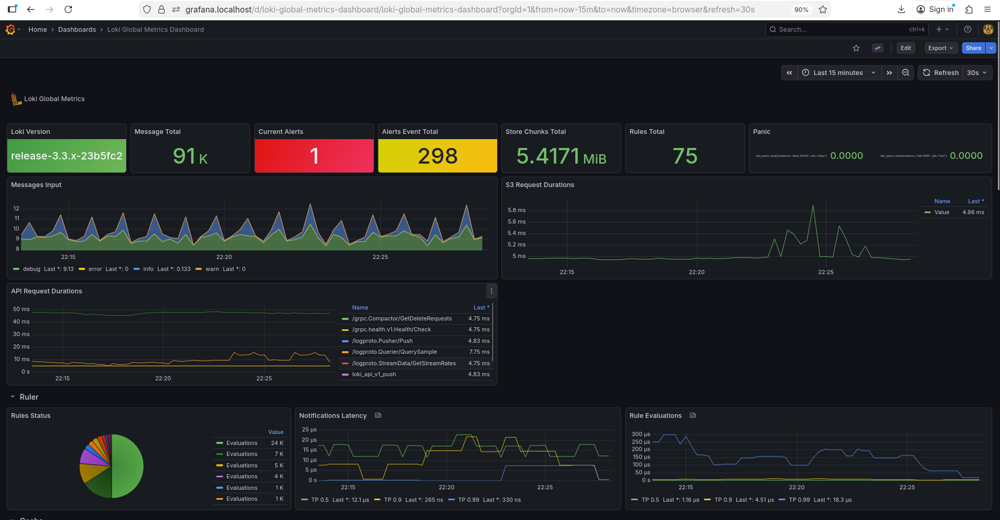

**Docs:**

* https://grafana.com/docs/loki/latest/
* https://github.com/grafana/loki

### 7.5 Tempo

Grafana Tempo is a high-volume, distributed tracing backend designed to track the lifecycle of requests as they travel through complex, interconnected microservices. It helps developers and operators pinpoint exactly where latency, bottlenecks, or errors are occurring in a system. Unlike older tracing tools that require heavy, complex databases for indexing (like Elasticsearch or Cassandra), Tempo is exceptionally cost-effective because it only requires a basic object storage backend to store the raw trace data.

In this observability stack, applications (and components like Traefik and Grafana) send their traces to the OpenTelemetry Collector, which acts as a router and pushes them to Tempo. Within Grafana, users can query and visualize these request lifecycles using TraceQL. Thanks to standard Trace IDs, you can seamlessly jump directly from a log line in Loki or an exemplar in Prometheus to the exact corresponding trace span in Tempo for rapid root cause analysis.



**How it works in this stack (tempo.yaml):** The internal workings and storage behaviors of Tempo are configured in [./tempo/tempo.yaml](./tempo/tempo.yaml). This file instructs Tempo on how to handle incoming traces and where to put them:

* **Receivers:** Configures Tempo to ingest trace data. In our setup, it primarily receives traces via the OTLP protocol directly from the local OpenTelemetry Collector.
* **S3 Storage Backend (MinIO):** Instructs Tempo to use the s3 storage backend. It connects to our local MinIO instance (`http://minio:9000`) using the minio credentials and stores all trace blocks securely in the tempo-data bucket.
* **WAL (Write-Ahead Log):** Defines a local path (`/var/tempo/wal`) where Tempo temporarily buffers incoming traces before they are fully batched and uploaded to MinIO. This ensures no traces are lost if the container unexpectedly restarts.
* **Compactor:** A background process that periodically scans the MinIO bucket, combining smaller trace blocks into larger ones to improve querying performance and manage data retention policies.

Tempo does not include a built-in user interface. Instead, it relies entirely on Grafana to serve as the unified dashboard for exploring and analyzing your traces, for example:

*See the screenshot below for an impression of a Tempo Trace through Traefik and Grafana:*
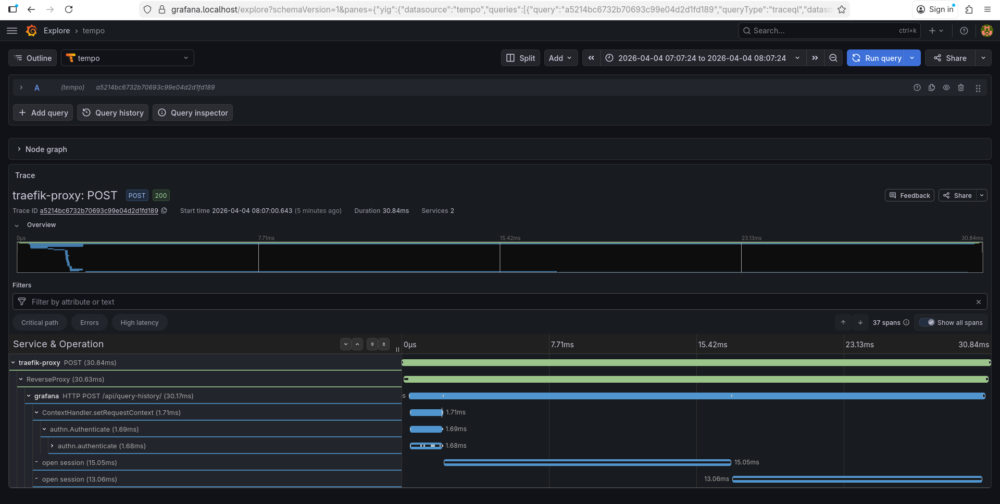

| configuration        | configuration file                         |
|----------------------|--------------------------------------------|
| Tempo config         | [./tempo/tempo.yaml](./tempo/tempo.yaml)   |

*Tempo exposes Prometheus metrics too, which are used to monitor Tempo using the dashboard below:*


**Docs:**

* https://grafana.com/docs/tempo/latest/
* https://github.com/grafana/tempo

### 7.6 Alertmanager

Alertmanager handles alerts sent by client applications such as the Prometheus server and Loki's Ruler. While Prometheus and Loki evaluate data and fire alerts based on predefined thresholds, Alertmanager takes over the complex logistics of notification management.

Its primary goal is to prevent "alert fatigue" during major incidents. It achieves this by deduplicating redundant alerts, grouping related alerts together into a single notification, and intelligently routing them to the correct downstream receivers (like email, Slack, or webhook endpoints). It also provides operational features such as silencing (temporarily muting specific alerts) and inhibition (suppressing lower-priority alerts, like warnings, when a related critical alert is already active).



**How it works in this stack:** The core behavior and routing logic of Alertmanager are defined in [./alertmanager/alertmanager.yml](./alertmanager/alertmanager.yml). This configuration file orchestrates several key mechanisms:
* **The Routing Tree (route):** This section defines how incoming alerts are processed. It groups alerts based on specific labels (like alertname or severity). It sets timers such as group_wait (how long to wait to bundle alerts before sending the first notification), group_interval (how long to wait before sending updates about a group), and repeat_interval (how long to wait before re-sending a persistent alert).
* **Receivers (receivers):** This section defines the actual destinations for your alerts. In our educational stack, instead of sending emails or Slack messages, the receivers are configured as webhooks. Alerts are routed to the Webhook Tester (`http://webhook-tester:8080`) so you can easily inspect the raw JSON alert payloads for debugging, and to KeepHQ (`http://keep-backend:8080`) where the AIOps platform correlates and processes them further.
* **Inhibition Rules (inhibit_rules):** Defines logic to mute certain alerts if other specific alerts are already firing, keeping the dashboard and notifications focused on the root cause.

Go to https://alertmanager.localhost

| Path          | Description                                    |
|---------------|------------------------------------------------|
| `/#/alerts`   | Overview of current alerts                     |
| `/#/silences` | Ability to silence alerts                      |
| `/#/status`   | Alertmanager status and configuration overview |
| `/#/settings` | Alertmanager UI settings                       |


*See the screenshot below for an impression of the Alertmanager UI:*
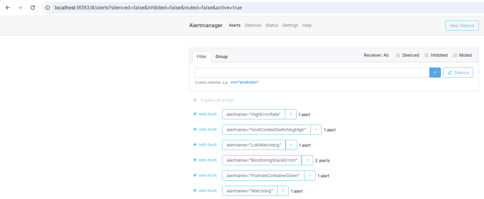

| configuration        | configuration file                                                  |
|----------------------|---------------------------------------------------------------------|
| Alertmanager config  | [./alertmanager/alertmanager.yml](./alertmanager/alertmanager.yml) |

Alertmanager exposes prometheus metrics too, which are used to monitor Alertmanager using the dashboard below:

*See the screenshot below for an impression of the Alertmanager metrics dashboard:*


**Docs:**

* https://prometheus.io/docs/alerting/latest/alertmanager/
* https://github.com/prometheus/alertmanager


### 7.7 Grafana

Go to https://grafana.localhost

Grafana is the central visual heart of this stack, functioning as the 'single pane of glass' for all your observability data. While Prometheus, Loki, and Tempo act as the backend storage and query engines, Grafana provides the unified frontend interface. It allows you to query, visualize, alert on, and understand your metrics, logs, and traces all in one place.


A major highlight of this environment is that Grafana is fully pre-provisioned via Infrastructure as Code (IaC). Instead of manually clicking through the UI to connect databases and build dashboards from scratch, everything is automatically injected the moment the container starts.

**Docs:**

* https://grafana.com/docs/grafana/latest/
* https://github.com/grafana/grafana

#### 7.7.1 Dashboards

**Automated dashboard provisioning:** [./grafana-provisioning/dashboards/dashboard.yaml](./grafana-provisioning/dashboards/dashboard.yaml) acts as a dashboard provider configuration. It tells Grafana to recursively scan the local directory `./grafana-provisioning/dashboards/json/` for any .json files and automatically load them into the UI. Because of this, all the specialized dashboards (for Node Exporter, Podman, Alloy, Blackbox, MinIO, etc.) are instantly available for use without requiring manual import steps.

*See the screenshot below for an overview of the Grafana Dashboards:*


#### 7.7.2 Explore

The Explore mode provides an advanced interface for ad-hoc analysis and troubleshooting, where users can execute queries directly. Explore thus facilitates rapid incident diagnosis and root-cause analysis, without the need to configure predefined dashboards in advance.

**Loki logs explore**

 The Loki datasource combined with LogQL makes it possible to efficiently filter log streams by labels, search for specific text patterns or regular expressions, and visualize log volumes alongside raw log lines.

 *See the screenshot below for an impression of the Explore logs:*
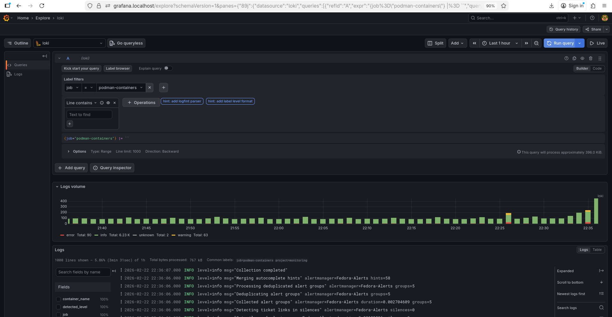

**Prometheus metrics explore**

The Prometheus datasource, combined with PromQL queries, enables iterative exploration of time-series data, trend visualization, and comparison of metrics using split-view functionality.

*See the screenshot below for an impression of the Explore metrics:*
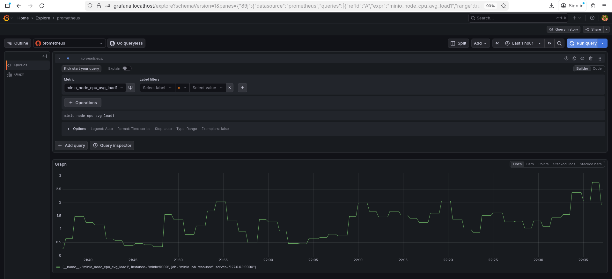

**Tempo tracing explore**

The Tempo datasource combined with TraceQL provides a detailed visualization of the lifecycle of requests through the distributed architecture. Using the waterfall view, users can analyze latency per component, isolating performance bottlenecks and errors within specific spans. Integration with TraceQL enables targeted filtering of traces, which, combined with correlated logs and metrics, allows efficient root-cause analysis during incidents. For example, it can be interesting to filter for requests that do not have an HTTP status code of 4xx or 5xx, or requests that take longer than 500ms.

*See the screenshot below for an impression of the Explore traces:*
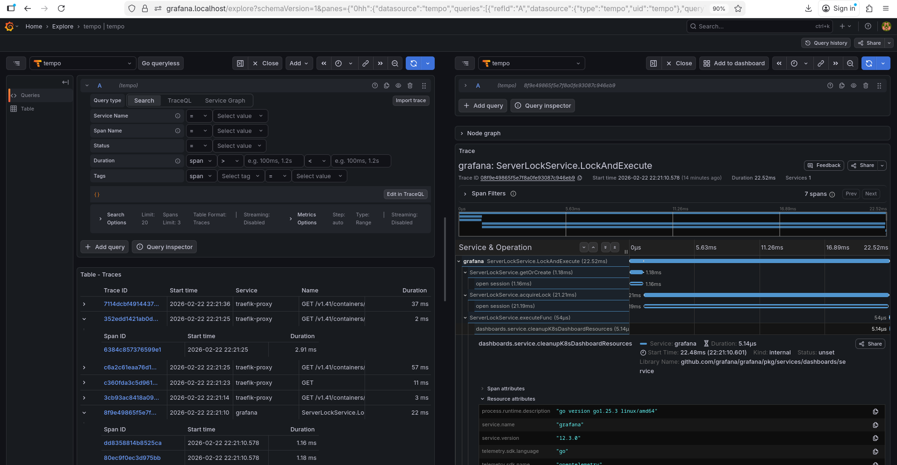


To manually test the proxy path by sending a traceparent header, run this command in your terminal:
```bash
   curl -k -H "traceparent: 00-11112222333344445555666677778888-1111222233334444-01" https://grafana.localhost/api/health
```
Next, in Grafana, go to Tempo Explore and search for the exact Trace ID: 11112222333344445555666677778888.
If propagation works, you'll see a beautiful trace tree with the Traefik span at the top and the Grafana span below.

*See the screenshot below for an impression of the Explore traces - service graph:*
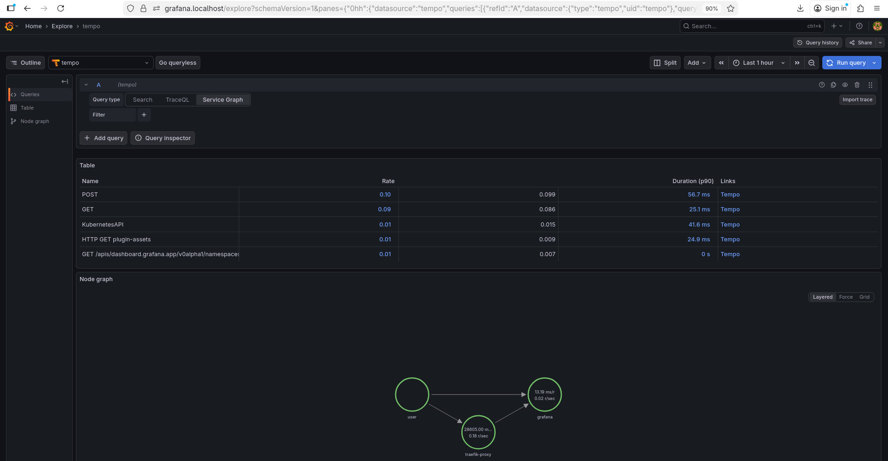

**Pyroscope profiling explore**

The Pyroscope datasource allows you to query continuous profiling data. Using Flame Graphs, you can visually analyze exactly which functions or lines of code are consuming the most CPU time or Memory allocations over a selected period. You can also use the "Diff" view to compare a profile from a healthy period against a profile from an incident period.

*See the screenshot below for an impression of the Explore profiles:*
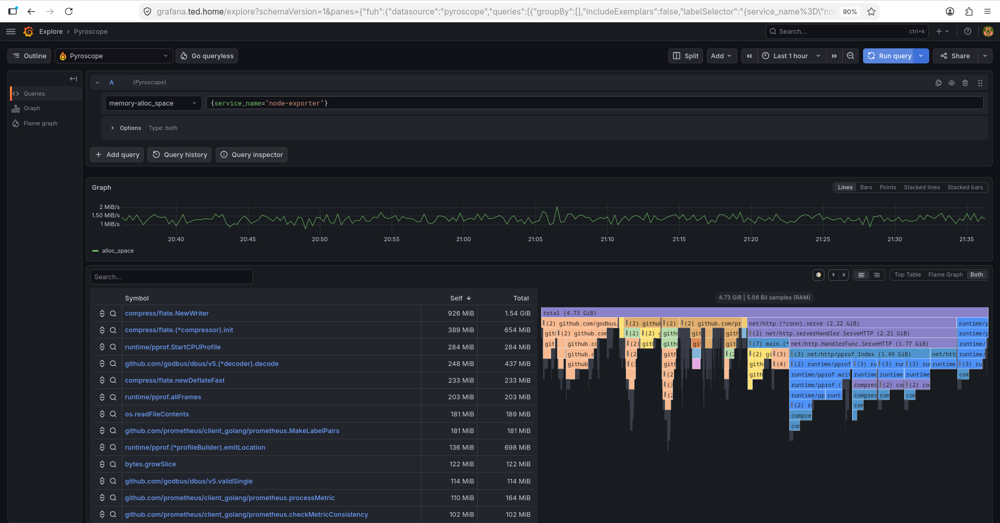

#### 7.7.3 Drilldown

The drill-down functionality within Grafana offers the ability to connect in-depth error analysis through metrics, logs, traces and profiles contextually with each other. From an anomaly in a metrics dashboard, you can directly navigate to the correlated log lines in Loki, and then use automatically detected trace IDs to switch to detailed request spans in Tempo. Finally, you can click on a specific Tempo span to open the exact Pyroscope Flame Graph for that exact millisecond in time. This integration eliminates the need to manually synchronize timestamps and identifiers between different datasources, significantly increasing the efficiency of root cause analysis and performance optimization.

*See the screenshot below for an impression of the Metrics drilldown:*
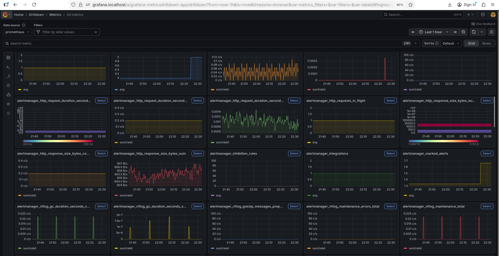

*See the screenshot below for an impression of the Logs drilldown:*
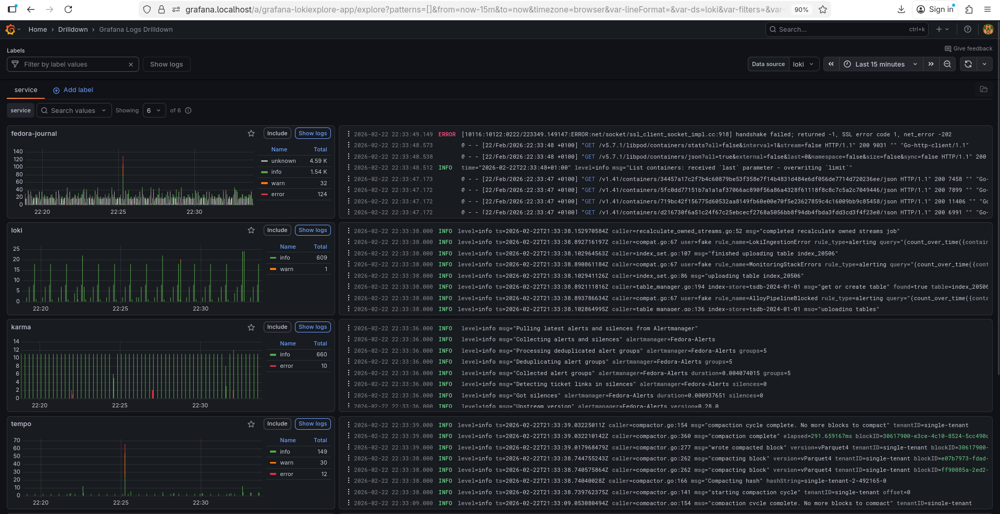

*See the screenshot below for an impression of the Traces drilldown:*
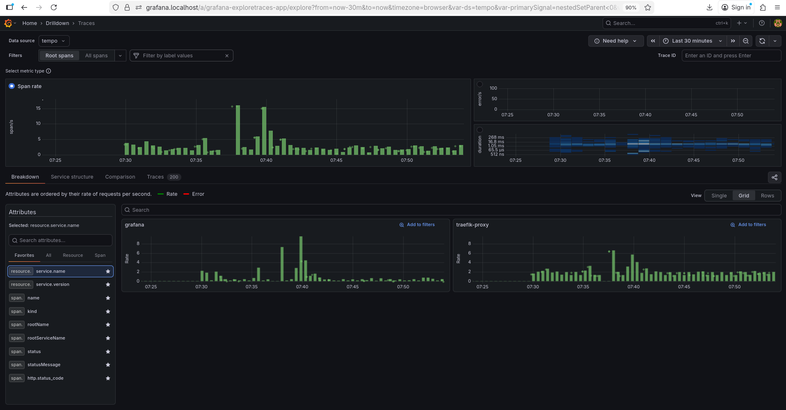

*See the screenshot below for an impression of the Profiling drilldown:*
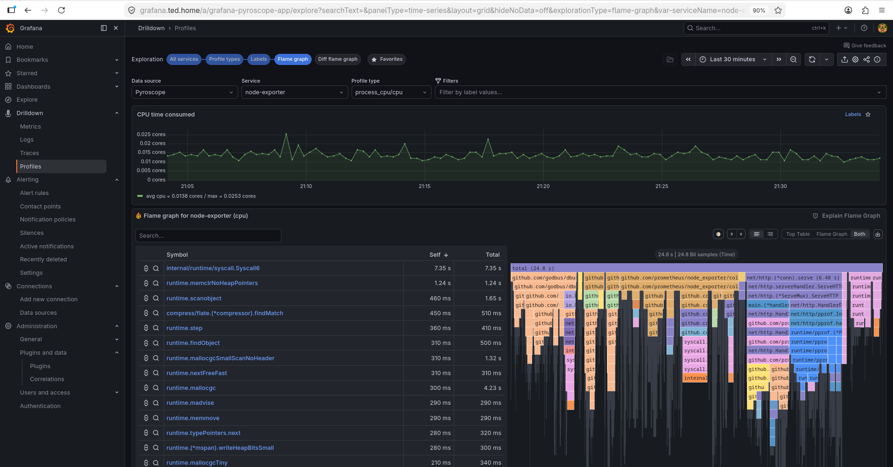

#### 7.7.4 Grafana alerts

Grafana Alerting provides a central interface for monitoring alerts. This module aggregates alert rules from both Prometheus (for metrics) and Loki (for log data), creating an overview of the operational status. Through this dashboard you can analyze the real-time status of alerts (‘Pending’ or ‘Firing’), examine the underlying query definitions, and gain insight into the evaluation criteria that safeguard the platform’s stability and availability.

*See the screenshot below for an impression of the Grafana Alerting:*
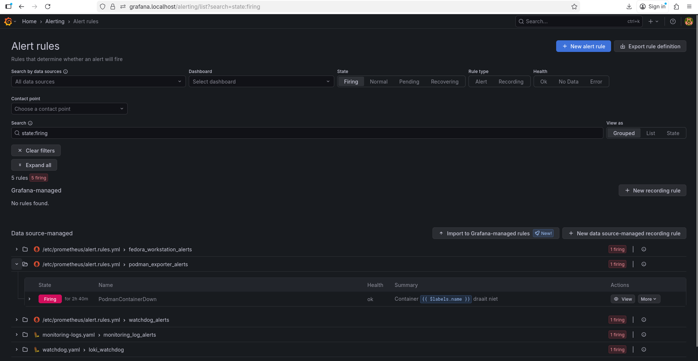

#### 7.7.5 Grafana datasources

Datasources in Grafana serve as the technical interface to the underlying data storage systems, allowing the application to retrieve data without persisting it itself. In this configuration, Prometheus, Loki and Tempo are defined as the primary sources for exposing metrics, log files and distributed traces, respectively.

[./grafana-provisioning/datasources/datasources.yaml](./grafana-provisioning/datasources/datasources.yaml) instructs Grafana exactly how to connect to the internal network endpoints for Prometheus (`http://prometheus:9090`), Loki (`http://loki:3100`), and Tempo (`http://tempo:3200`). More importantly, this file configures the contextual correlations between them. For example, it defines "Derived Fields" for Loki, telling Grafana: "If you see a 32-character string that looks like a Trace ID in a log line, make it a clickable button that instantly opens that exact trace in Tempo." It also sets up exemplar links between Prometheus metrics and Tempo traces.

*See the screenshot below for an impression of the Grafana Datasources:*


The datasources for Prometheus, Loki and Tempo are configured in [./grafana-provisioning/datasources/datasources.yaml](./grafana-provisioning/datasources/datasources.yaml).

### 7.8 Karma Alert Dashboard

Karma is a specialized, highly visual dashboard designed specifically for Alertmanager. While Alertmanager excels at routing and grouping alerts, its default UI is quite basic. Karma fills this gap by providing an intuitive, color-coded, and auto-refreshing interface that gives Operations and DevOps teams a consolidated overview of the platform's health at a glance.

Go to https://karma.localhost



**How it works in this stack:**

* **Direct Alertmanager Integration:** Karma continuously polls Alertmanager to display active alerts in organized, collapsible groups based on their severity and source.
* **Prometheus History:** It connects directly to Prometheus to enrich the current alerts with historical context, allowing you to see if an alert has been flapping.
* **Custom Color Coding:** As defined in karma.yaml, alerts are customized with distinct colors based on their severity (e.g., Red for Critical, Orange for Warning) and the specific job that triggered them (e.g., node-exporter, loki, alloy). This makes visual identification instantaneous.
* **Noise Reduction:** It automatically filters out constant background alerts like the 'Watchdog' (dead man's switch) and strips redundant receiver labels to keep the dashboard clean and actionable.
* **Live Auto-Refresh:** The dashboard automatically refreshes every 20 seconds so you never miss a critical state change.

| configuration        | configuration file                         |
|----------------------|--------------------------------------------|
| Karma config         | [./karma/karma.yaml](./karma/karma.yaml)   |

**See the screenshot below for an impression of the Karma UI:*

An overview of all active warnings (e.g., "Disk almost full", "Container down" or "Health Check Failed").

*See the screenshot below for an impression of the karma metrics dashboard:*
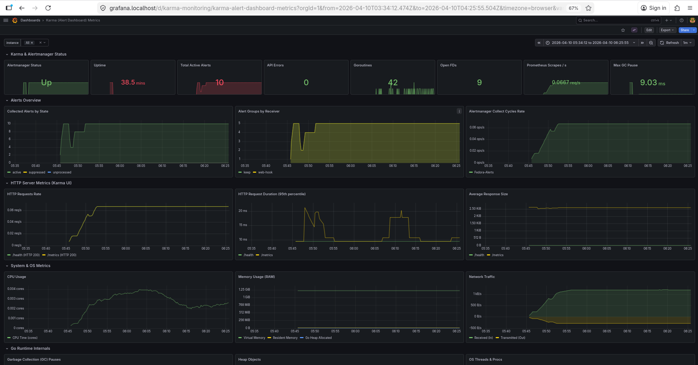

**Docs:**

* https://github.com/prymitive/karma

### 7.9 webhook-tester

Webhook-tester is a lightweight and incredibly useful utility for debugging and inspecting incoming HTTP requests. In this observability stack, it acts as a "dummy" or "catch-all" receiver for Alertmanager.

Go to https://webhook-tester.localhost



**How it works in this stack:** When Prometheus fires an alert, Alertmanager processes and routes it based on its configuration. By configuring Alertmanager to send a webhook to this tester, you can inspect the exact, raw JSON payloads that Alertmanager generates in real-time. This is highly beneficial for:

* **Debugging Alert Payloads:** Understanding the exact data structure, labels, and annotations that get sent out when an alert triggers.
* **Template Development:** Testing custom notification templates before connecting them to real-world communication channels (like Slack, Microsoft Teams, or PagerDuty).
* **Integration Testing:** Verifying that the alert routing rules in Alertmanager are working correctly and actually triggering the appropriate webhooks.

*See the screenshot below for an impression of the Webhook-tester UI:*
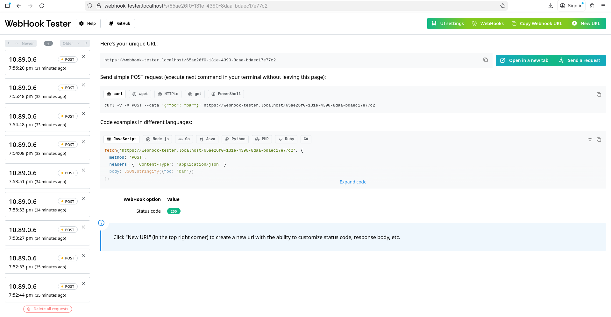

**Docs:**

* https://github.com/tarampampam/webhook-tester

### 7.10 KeepHQ

KeepHQ is an open-source AIOps and alert management platform. While Alertmanager handles the initial routing and deduplication of alerts, KeepHQ takes alert management a step further by providing advanced correlation, noise reduction, and automated workflow execution (auto-remediation). It acts as a single pane of glass for all your alerts, enriching them with context from various tools.

https://keep.localhost



**How it works in this stack:** KeepHQ is deployed using three containers: a PostgreSQL database (`keep-db`), the core API and AIOps engine (`keep-backend`), and the web interface (`keep-frontend`).

**Automatic Provider Configuration (IaC):** For KeepHQ to intelligently correlate alerts and execute workflows, it needs access to your metrics and logs. Instead of manually configuring these connections in the Keep UI, this stack automatically provisions them on startup using provider configuration files located in `./keep/providers/`:

| provider config                                   | description                                                                                                                                                                                                   |
|---------------------------------------------------|---------------------------------------------------------------------------------------------------------------------------------------------------------------------------------------------------------------|
| [prometheus.yml](./keep/providers/prometheus.yml) | Automatically configures the local Prometheus instance as a data source (`http://prometheus:9090`). This allows KeepHQ to dynamically query time-series metrics to gather deeper context when an alert fires. |
| [loki.yml](./keep/providers/loki.yml)             | Automatically configures the local Grafana Loki instance as a data source (`http://loki:3100`). This enables KeepHQ to directly fetch relevant log lines and event streams associated with an incident.       |

By injecting these configurations via Infrastructure as Code, KeepHQ is instantly ready to query both metrics and logs the moment the stack boots up, significantly accelerating troubleshooting and providing a seamless AIOps experience.

*See the screenshot below for an impression of the KeepHQ feeds UI:*
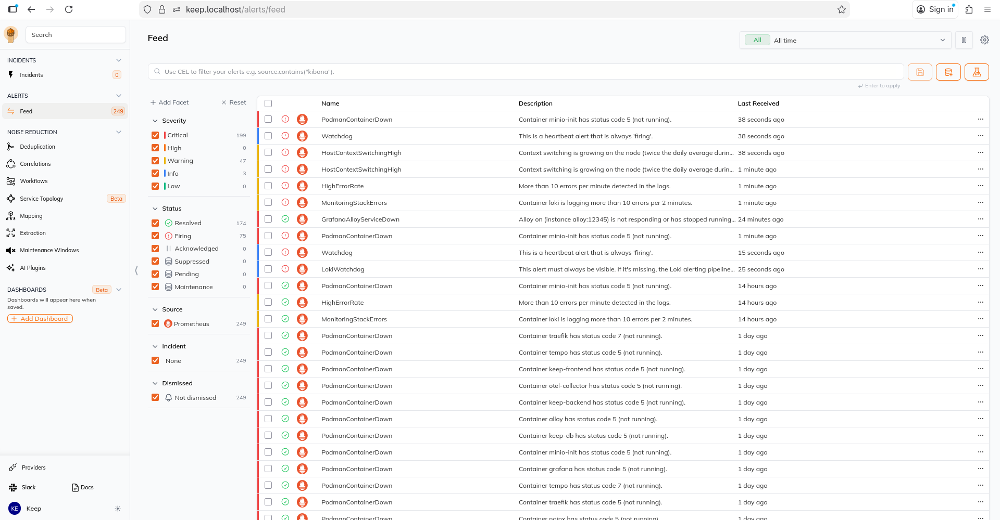

*See the screenshot below for an impression of the KeepHQ plugins:*
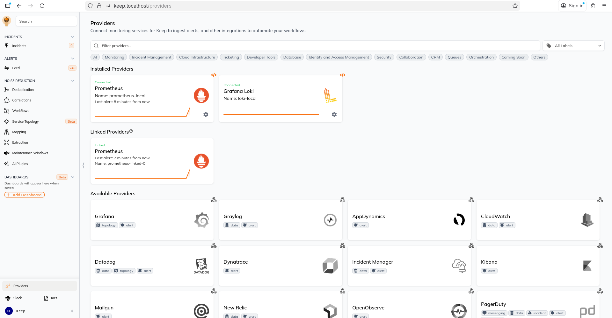

*See the screenshot below for an impression of the KeepHQ metrics dashboard:*
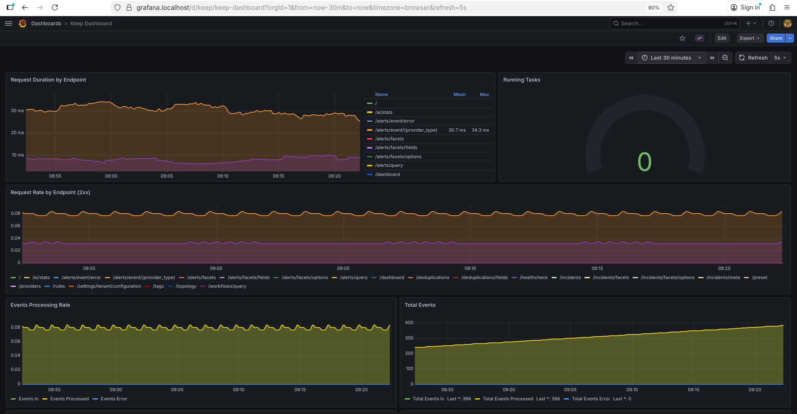

**Docs:**

* https://docs.keephq.dev/overview/introduction
* https://github.com/keephq/keep

### 7.11 Storage (MinIO)

MinIO is a high-performance, S3-compatible object storage server. In this observability stack, it serves as the persistent, long-term storage backend for both Grafana Loki (logs) and Grafana Tempo (traces).

Go to https://minio.localhost

**Why use MinIO?** Modern observability tools like Loki and Tempo have deliberately moved away from requiring heavy, complex databases (like Elasticsearch or Cassandra) for storage. Instead, they maintain a lightweight local index and push the bulk of their compressed log chunks and trace data into cheap, scalable object storage. MinIO provides this exact S3-like API locally, mimicking what you would use in the cloud (like AWS S3 or Google Cloud Storage).

**How it works in this stack:**

* **Automatic Bucket Provisioning:** When you start the stack, a temporary helper container named `minio-init` runs alongside the main MinIO server. It automatically connects to the server and creates the necessary storage buckets (loki-data and tempo-data). Once done, the helper container gracefully exits.
* **Storage Flow:** Loki and Tempo are configured to treat MinIO just like AWS S3. As they collect logs and traces, they bundle them into chunks and push them to their respective buckets in MinIO.
* **Console & Management:** Through the MinIO UI (link above), you can browse these objects, inspect bucket policies, and see exactly how much storage your logs and traces are consuming.

*See the screenshot below for an impression of the MinIO UI - login:*


*See the screenshot below for an impression of the MinIO UI - object browser:*


*See the screenshot below for an impression of the MinIO overview dashboard:*


*See the screenshot below for an impression of the MinIO bucket dashboard:*


*See the screenshot below for an impression of the MinIO node dashboard:*


**Docs:**

* https://github.com/minio/minio
* https://docs.min.io/enterprise/aistor-object-store/

### 7.12 Alloy

Grafana Alloy is a highly configurable, vendor-neutral observability data pipeline. In this monitoring stack, Alloy acts as the primary log collector and processor, bridging the gap between your raw logs (both container and host-level) and Grafana Loki.

Go to https://alloy.localhost


**How it works in this stack (config.alloy):** The configuration file located at [./alloy/config.alloy](./alloy/config.alloy) defines two main data streams that converge into a single output pushed to Loki:

* **Stream 1:** Container Logs (`Podman Socket`): Alloy discovers all running containers via the local Podman socket (`/var/run/docker.sock`). Instead of just grabbing raw logs, it enriches them with highly useful metadata. It extracts the container_name, shortens the container_id to 12 characters for precision, and tags the image, pod_name, and compose project. This enrichment is what allows you to effortlessly filter logs in Grafana based on specific containers or pods.
* **Stream 2:** Host System Logs (`Journald`): Alloy also reads the host machine's system logs directly from `/var/log/journal`. It extracts the systemd unit (e.g., sshd.service), syslog_identifier, and the log level (e.g., info, warning, err) so you can quickly filter for host-level errors.
* **Smart Deduplication:** Because rootless Podman automatically writes container logs to the host's system journal as well, simply collecting both streams would result in duplicate logs in Loki. The config.alloy explicitly prevents this by applying a loki.relabel rule that drops any journald log containing a container ID. This ensures your logs remain clean and accurate.

Through the Alloy web UI, you can view the health of these components and visually inspect the data flow pipeline using the Graph tab.

*See the screenshot below for an impression of the Alloy UI:*


*See the screenshot below for an impression of the Alloy Graph:*


*See the screenshot below for an impression of the Alloy metrics dashboard:*
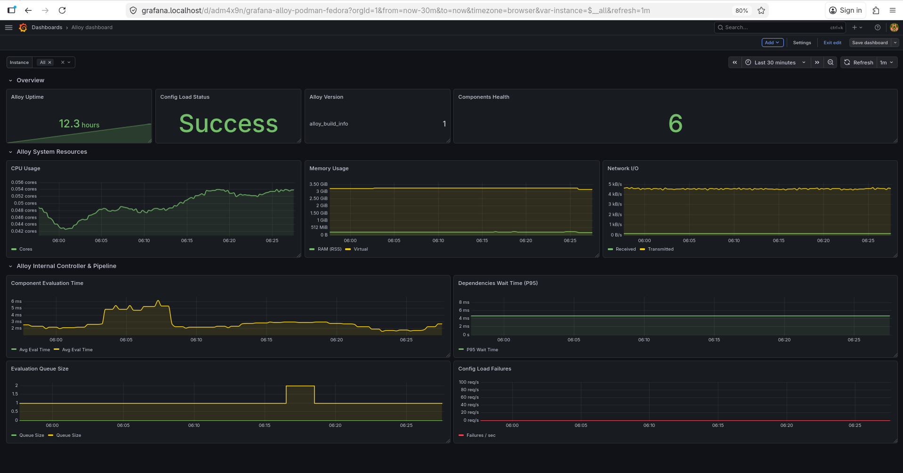

**Docs:**

* https://grafana.com/docs/alloy/latest
* https://github.com/grafana/alloy

### 7.13 Blackbox exporter

The Prometheus Blackbox Exporter is a probing tool that allows you to monitor the external health, availability, and response times of your endpoints. Instead of relying on internal application metrics (white-box monitoring), the Blackbox Exporter performs active "black-box" testing by making HTTP requests, TCP connections, or ICMP pings over the network just like a real user or client would.

https://blackbox.localhost


**How it works in this stack:** The Blackbox Exporter acts as a proxy. Prometheus asks the Blackbox Exporter to probe a specific target using a specific module, and the Exporter returns metrics based on the result of that probe (e.g., probe_success, probe_duration_seconds).

* **Configuration (blackbox.yml):** The configuration file located at [./blackbox/blackbox.yml](./blackbox/blackbox.yml) defines the modules (the "how"). For instance, it configures an `http_2xx` module which dictates that a probe is only successful if the target returns an HTTP 200 OK status. It also defines modules like tcp_connect to verify if a raw network port is open.
* **Prometheus Scrape Jobs** (`prometheus.yaml`): While blackbox.yml defines the methods, prometheus.yaml defines the targets (the "what"). This stack includes several dedicated scrape jobs to ensure critical services are running:

| prometheus scrape Job | description                                                                                                                                                                                                                                                  |
|-----------------------|--------------------------------------------------------------------------------------------------------------------------------------------------------------------------------------------------------------------------------------------------------------|
| blackbox-http         | A general-purpose job that probes standard web endpoints to verify if HTTP services are responding correctly.                                                                                                                                                |
| blackbox-keep-api     | A targeted probe specifically monitoring the backend API of KeepHQ to ensure the AIOps engine is healthy and accepting requests.                                                                                                                             |
| blackbox-keep-ui      | A targeted probe verifying that the KeepHQ frontend interface is accessible to users.                                                                                                                                                                        |
| blackbox-tcp          | This job uses the TCP module to probe non-HTTP services. It checks if specific ports (like database ports or internal communication sockets) are open and successfully accepting TCP handshakes.                                                             |
| blackbox_exporter     | This job doesn't probe external targets. Instead, it scrapes the internal metrics of the Blackbox Exporter container itself, allowing you to monitor how many probes have been executed, how long they took, and if the exporter is experiencing any errors. |

*See the screenshot below for an impression of the Blackbox dashboard:*
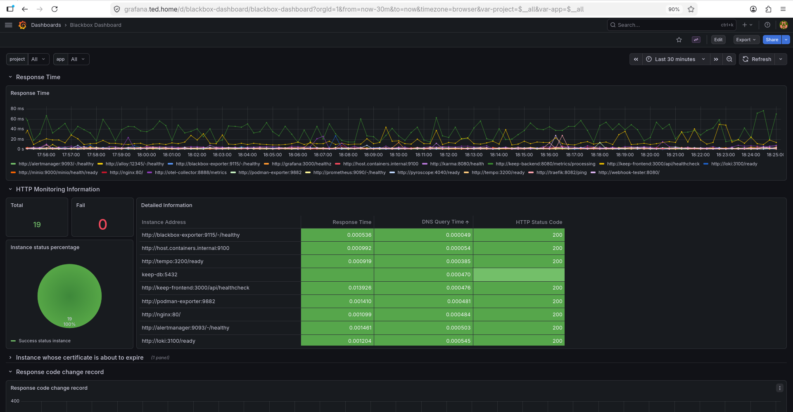

**Docs:**

* https://github.com/prometheus/blackbox_exporter

### 7.14 node-exporter

The Prometheus Node Exporter is a fundamental component for infrastructure monitoring. While other exporters focus on specific applications, databases, or container engines, the Node Exporter focuses entirely on the host machine itself (in this case, your underlying Fedora Workstation).

**How it works in this stack:** It exposes a wide variety of hardware and OS-level metrics, such as CPU utilization, memory consumption, disk space, disk I/O, network bandwidth, and system load. Prometheus scrapes these metrics, allowing you to trigger alerts (e.g., "Disk almost full") and visualize the overall health of your host hardware.

**Bypassing Container Isolation (compose.yml):** By design, containers are isolated from the host. To accurately measure the host's hardware, the Node Exporter container requires special configuration. In the compose.yml, it is explicitly set to use network_mode: host and pid: host. Additionally, it mounts the host's entire root filesystem (/) to a /host directory inside the container. This deliberately breaks the container's isolation, allowing the exporter to read the actual /proc and /sys files of the underlying host operating system.

*See the screenshot below for an impression of the node-exporter-full dashboard:*
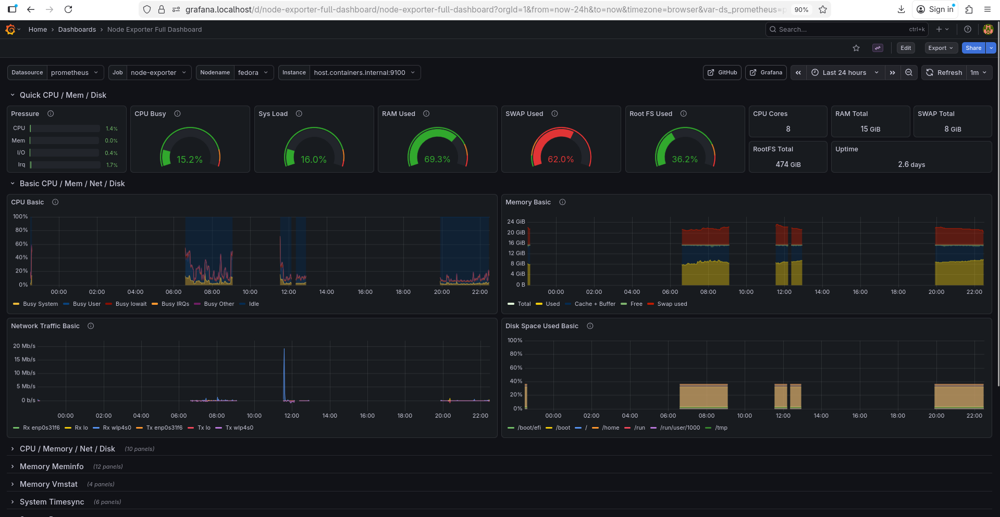

**Docs:**

* https://prometheus.io/docs/guides/node-exporter/
* https://github.com/prometheus/node_exporter

### 7.15 podman-exporter

The Prometheus Podman Exporter is designed to extract metrics specifically from a Podman environment. Since this observability stack intentionally uses daemonless, rootless Podman instead of Docker, traditional Docker exporters will not work. This exporter bridges that gap by providing deep visibility into your container runtime.

**How it works in this stack:** It exposes comprehensive metrics about running containers, pods, images, and volumes (e.g., container CPU/memory usage, network I/O, and container state). Prometheus scrapes these metrics, which power the dedicated Podman Grafana dashboards, allowing you to track the exact resource footprint of each service in the stack.

**Rootless Socket Connection (compose.yml):** To gather these metrics securely, the exporter needs to talk to the Podman API. In the compose.yml, this is achieved by mapping the host user's specific rootless Podman socket (`/run/user/1000/podman/podman.sock`) directly into the container. Furthermore, an environment variable `CONTAINER_HOST=unix:///run/podman/podman.sock` directs the exporter to listen to this specific socket, allowing it to monitor the containers without requiring root privileges on the host machine.

*See the screenshot below for an impression of the podman-exporter dashboard:*
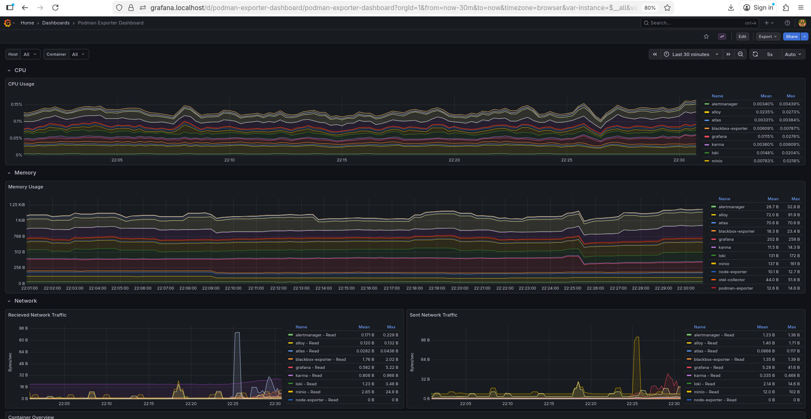

**Docs:**

* https://github.com/containers/prometheus-podman-exporter

### 7.16 OpenTelemetry-collector

The OpenTelemetry (OTel) Collector is a vendor-agnostic proxy, router, and processor for telemetry data. While it has the capability to handle metrics and logs, in this observability stack it is primarily dedicated to handling distributed traces.



**How it works in this stack:** Instead of applications sending trace data directly to the storage backend (Tempo), they send them to the OTel Collector. This architectural pattern decouples your applications from the storage backend, allowing you to easily switch backends, filter sensitive data, or batch requests without needing to change any application code.

* **Trace Ingestion (OTLP):** The collector listens for incoming traces via the standard OpenTelemetry Protocol (OTLP) over gRPC on port `4317`. For instance, Grafana itself is configured in the compose.yml to send its internal traces to this exact port (`GF_TRACING_OPENTELEMETRY_OTLP_ADDRESS=otel-collector:4317`).
* **Forwarding to Tempo:** Once the collector receives and processes the incoming trace spans, it exports them directly to the local Grafana Tempo container, which subsequently stores them persistently in MinIO.
* **Traefik gRPC Routing (compose.yml):** To allow external applications or microservices to securely send traces to the collector, Traefik is configured with a dedicated TCP router using Server Name Indication (SNI). The rule `HostSNI('otel-collector.localhost')` routes incoming gRPC traffic directly to the collector. Additionally, the collector exposes its own internal health and performance metrics via an HTTP endpoint on port `8888`.

*See the screenshot below for an impression of the OpenTelemetry-collector dashboard:*
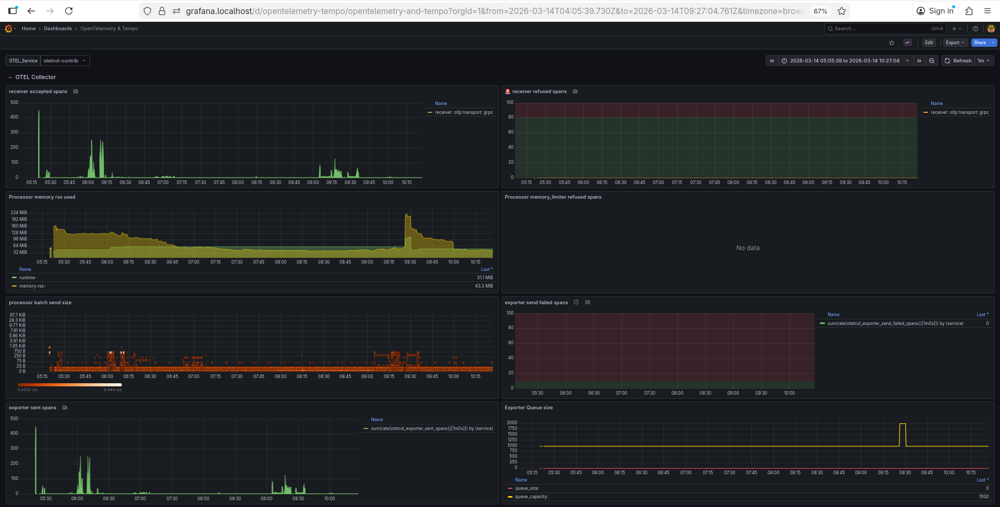

**Docs:**

* https://opentelemetry.io/docs/collector/
* https://github.com/open-telemetry/opentelemetry-collector

### 7.17 Traefik

Traefik acts as the Edge Router and Reverse Proxy for this entire observability stack. It is the single entry point that intercepts all incoming requests (like when you visit `https://grafana.localhost`) and dynamically routes them to the correct backend container. Furthermore, it handles all TLS/SSL termination, ensuring your local connections are secure and free of browser warnings.

Go to: https://traefik.localhost



**How it works in this stack:** Traefik uses a combination of auto-discovery and file-based configurations to manage routing:

* **Container Auto-Discovery** ([./compose.yml](./compose.yml)): By mounting the rootless Podman socket, Traefik automatically discovers running containers. The routing rules are defined directly on the containers using Docker labels (e.g., `traefik.http.routers.grafana.rule=Host('grafana.localhost'`)).
* **Static Configuration** ([./traefik/traefik.yaml](./template/traefik.yaml)): This is the main startup configuration. It defines the global "EntryPoints" (port 80 for HTTP, 443 for HTTPS, and 4317 for OTLP). It enforces an automatic redirect from HTTP to HTTPS for all traffic. Additionally, it configures Traefik to send its own internal distributed traces to the OpenTelemetry Collector and exposes its metrics for Prometheus to scrape.
* **Dynamic Certificates** ([./traefik/dynamic/tls.yaml](./traefik/dynamic/tls.yaml)): Traefik continuously watches the dynamic directory. This specific file instructs Traefik where to find the custom wildcard certificates (`server.crt` and `server.key`) generated by the `renew-certs.sh` script, applying them automatically to all `*.localhost` routes.
* **Dynamic Routing** ([./traefik/dynamic/traefik-dynamic.yaml](./template/traefik-dynamic.yaml)): While most routing is handled automatically via labels, some services require manual rules. Because the Node Exporter runs on the host network (network_mode: host) to collect accurate hardware data, it lives outside the standard container bridge network. This file explicitly tells Traefik to route requests for node-exporter.localhost out of the container network and into the host machine via `http://host.containers.internal:9100`.

*See the screenshot below for an impression of the Traefik UI:*
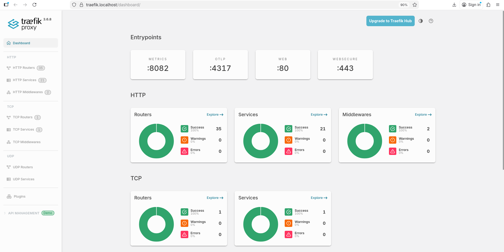

*See the screenshot below for an impression of the Traefik dashboard:*
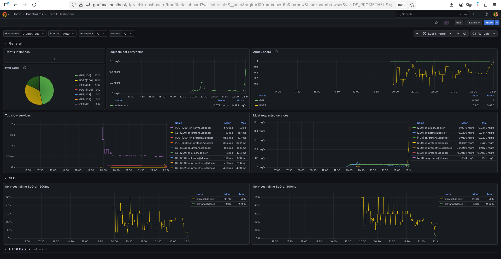

**Docs:**

* https://doc.traefik.io/traefik/getting-started/
* https://github.com/traefik/traefik

### 7.18 Pyroscope 

Grafana Pyroscope is a continuous profiling tool. While metrics tell you what is happening (e.g., CPU is at 100%), and traces tell you where it is happening (e.g., a specific API endpoint is slow), profiling tells you exactly why it is happening by showing you the exact function or line of code responsible for the resource consumption.

Go to https://pyroscope.localhost

**How it works in this stack:**

* **Scraping via Alloy:** Instead of pushing profiles directly from applications, Grafana Alloy is configured to actively scrape standard pprof endpoints. In this educational stack, Alloy scrapes the CPU and Memory profiles of your monitoring tools themselves (Prometheus, Loki, and Alloy).
* **S3 Storage Backend (MinIO):** Pyroscope connects to the local MinIO instance (http://minio:9000) and stores all profiling data in the pyroscope-data bucket.* **Data Retention:** Profiling data can grow quickly. Pyroscope's built-in compactor is configured to aggregate this data and enforce a strict 14-day retention policy (block_retention: 336h), automatically cleaning up old profiles from MinIO.
* **Trace-to-Profile Integration:** In Grafana, the Tempo datasource is explicitly linked to the Pyroscope datasource using the service.name tag. This creates a seamless UI experience where you can jump from a trace span directly into a Flame Graph.

| configuration       | configuration file         |
|---------------------|----------------------------|
| Pyroscope config    | ./pyroscope/pyroscope.yaml |
| Alloy Scrape config | ./alloy/config.alloy       |

*See the screenshot below for an impression of the Pyroscope metrics dashboard:*
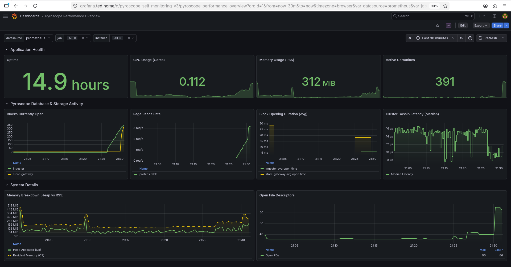

**Docs:**

* https://grafana.com/docs/pyroscope/latest/
* https://github.com/grafana/pyroscope

## 8. Teardown & Cleanup

This section explains how to remove everything.

```bash
   # stop all containers
   podman compose down

   # (optional) remove the compose network if it still exists
   # check the network name first; typically 'monitoring_monitoring-net'
   podman network ls | grep monitoring || true
   podman network rm monitoring_monitoring-net 2>/dev/null || true

   # show volumes
   podman volume ls | grep monitoring_
   local       monitoring_prometheus-data
   local       monitoring_loki-wal
   local       monitoring_tempo-wal
   local       monitoring_minio-data
   local       monitoring_grafana-data
   local       monitoring_keep-db-data
   local       monitoring_keep-state

   # one-shot removal of any remaining project volumes
   podman volume rm $(podman volume ls -q | grep '^monitoring_') 2>/dev/null || true

   # remove certificates
   sudo rm /etc/pki/ca-trust/source/anchors/my-local-ca.pem
   sudo rm /etc/pki/ca-trust/source/anchors/my-local-ca.crt
   sudo update-ca-trust extract

   # disable podman socket
   systemctl --user disable --now podman.socket

   # remove rootless ports configuration file
   sudo rm /etc/sysctl.d/99-rootless-ports.conf
   # reset the runtime sysctl to the default privileged port start (1024)
   sudo sysctl -w net.ipv4.ip_unprivileged_port_start=1024

   # remove images
   for I in $(cat compose.yml | grep image: | awk '{print $2}' | sed -r 's/:.+$//'); do echo $I; for ID in $(podman images | grep $I | awk '{print $3}'); do podman rmi $ID; done; done

   # (optional) prune any stopped containers, unused networks, and images
   # This impacts your whole Podman host, not just this project.
   podman system prune -a -f

   # remove monitoring repo
   rm -rf path-to-your-repo/monitoring
```

Notes:
- If your browser trusted the local CA, restart the browser to ensure trust store changes take effect.
- The compose network is usually removed by `podman compose down`, but the explicit removal ensures a clean state.
