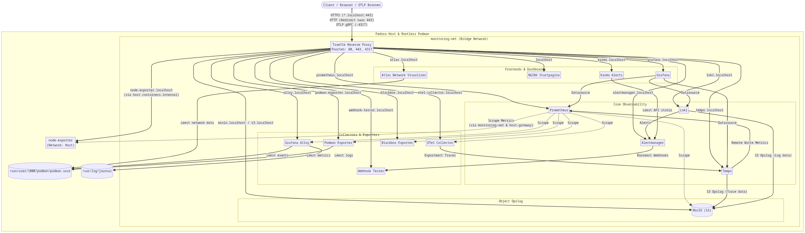

# Full Stack Observability & Monitoring Platform
## An Educational Lab for Prometheus, Loki, Tempo, Grafana, and Alerting

This repository contains a complete, production-like observability stack optimized for Fedora Workstation with rootless Podman. It is designed as an educational environment to help Developers and DevOps Engineers understand how modern monitoring tools interlock to provide comprehensive metrics, logging, tracing, and alerting capabilities. The entire stack is automatically configured upon startup, including pre-provisioned Grafana dashboards, datasources, and alerting rules.

Diagram


## Table of Contents

1. Educational Benefits
2. Architecture & Data Flow
3. Service Port Map
4. Tooling & Functionality
5. Prerequisites
6. Installation & Startup
7. Usage & Exploration (Screenshots)
8. Teardown & Cleanup

## 1. Educational Benefits

Why use this stack? This environment is built to teach you:

- **The Three Pillars of Observability**: How to seamlessly connect Metrics (Prometheus), Logs (Loki), and Traces (Tempo).
- **Contextual Drill-down**: How to configure Grafana datasources so you can jump directly from a spike in a metric to the specific log line, and then to the exact application trace.
- **Modern Collection**: Using Grafana Alloy and OpenTelemetry Collector as modern, vendor-neutral data pipelines.
- **S3-Compatible Storage**: How Loki and Tempo use MinIO object storage for scalable, long-term data retention instead of local disks.
- **Advanced Alerting Routing**: The flow of an alert from Prometheus -> Alertmanager -> KeepHQ / Karma / Webhook-tester.
- **Secure Local Networking**: Running a complex stack via Traefik Reverse Proxy with TLS/SSL on local `.localhost` domains using rootless Podman.

## 2. Architecture & Data Flow

The stack is designed around specific data flows:
- **Metrics Flow**: Node-exporter, Podman-exporter, and Blackbox-exporter expose metrics -> Prometheus scrapes them -> Grafana visualizes them.
- **Logging Flow**: System (journald) and Container logs -> Grafana Alloy collects them -> Pushed to Loki -> Stored in MinIO -> Visualized in Grafana.
- **Tracing Flow**: Application traces -> OpenTelemetry Collector -> Pushed to Tempo -> Stored in MinIO -> Visualized in Grafana.
- **Alerting Flow**: Prometheus evaluates alert.rules.yml -> Fires to Alertmanager -> Alertmanager routes to Karma (UI), KeepHQ (AIOps), and Webhook-tester.

## 3. Service Port Map

| Service         | Internal Port | Public URL                          | Description                              |
|-----------------|---------------|-------------------------------------|------------------------------------------|
| Nginx           | 80            | https://localhost                   | Landing page portal                      |
| Traefik         | 443 / 8082    | https://traefik.localhost           | Reverse proxy & Ingress routing          |
| Grafana         | 3000          | https://grafana.localhost           | Main visualization & Dashboard UI        |
| Prometheus      | 9090          | https://prometheus.localhost        | Time-series database                     |
| Loki            | 3100          | https://loki.localhost              | Log aggregation engine                   |
| Tempo           | 3200          | https://tempo.localhost             | Distributed Tracing backend              |
| MinIO           | 9000 / 9001   | https://minio.localhost             | S3 Object Storage for Loki & Tempo       |
| Alloy           | 12345         | https://alloy.localhost             | Log collection pipeline                  |
| OTel Collector  | 4317 / 8888   | https://otel-collector.localhost    | Trace collection pipeline                |
| Alertmanager    | 9093          | https://alertmanager.localhost      | Alert routing and deduplication          |
| Karma           | 8080          | https://karma.localhost             | Alert visualization dashboard            |
| KeepHQ          | 3000 / 8080   | https://keep.localhost              | Open-source AIOps and alert management   |
| Webhook Tester  | 8080          | https://webhook-tester.localhost    | Endpoint for inspecting webhook payloads |
| node-exporter   | 9100          | https://node-exporter.localhost     | Host metrics                             |
| podman-exporter | 9882          | https://podman-exporter.localhost   | Container metrics                        |
| Blackbox        | 9115          | https://blackbox-exporter.localhost | HTTP/TCP endpoint probe                  |


## 4. Tooling & Functionality

**1. Visualization & Portal**
   * Nginx (Portal): Serves as a static, central hub linking to all services and endpoints.
   * Grafana (v12.3): The 'single pane of glass'. Dashboards and Datasources are loaded automatically via Infrastructure as Code (IaC).

**2. Metrics (The "What is happening?")**
   * Prometheus: Scrapes targets, stores time-series data, and evaluates alert rules.
   * Exporters:
     * Node Exporter: Collects host hardware and OS metrics.
     * Podman Exporter: Collects metrics from rootless Podman containers.
     * Blackbox Exporter: Probes endpoints over HTTP/TCP to monitor uptime.

**3. Logging (The "Why is it happening?")**
   * Grafana Loki: Highly efficient log aggregation system. Uses MinIO for storage.
   * Grafana Alloy: The collector that reads journald and /var/run/podman.sock (Podman) and pushes logs to Loki.

**4. Tracing (The "Where is it happening?")**
   * Grafana Tempo: High-scale distributed tracing backend. Uses MinIO for storage.
   * OpenTelemetry (OTel) Collector: Receives OTLP traces and forwards them to Tempo.

**5. Storage & Infrastructure**
   * MinIO: S3-compatible storage providing scalable object storage for Tempo and Loki data.
   * PostgreSQL: Relational database backend for KeepHQ.
   * Traefik: Reverse proxy that acts as the entry point, handling routing and TLS termination for all .localhost domains.

**6. Alerting & AIOps**
   * Alertmanager: Groups, routes, and throttles alerts from Prometheus and Loki.
   * Karma: A clean, concise dashboard for viewing Alertmanager alerts.
   * KeepHQ: Centralized alert management and AIOps platform.
   * Webhook Tester: A simple tool to view the raw JSON payloads Alertmanager sends out.

## 5. Prerequisites

-   OS: Fedora Linux (tested on Fedora 43 and 44).
-   Tools: podman and podman-compose.
-   Podman Socket: The user socket must be active for the Podman Exporter and Alloy.
   
This stack is using `podman` and `podman-compose` where you may be used to `docker` and `docker-compose`. While Docker is commonly used, there are good reasons to use Podman due to several key architectural and security advantages:

*   **Daemonless Architecture:** Unlike Docker, which requires a heavy, central background daemon (`dockerd`) running as root to manage containers, Podman is daemonless. It interacts directly with the container registry and runtime. This means no single point of failure—if the Docker daemon crashes, container management halts. With Podman, each container runs as an independent process.
*   **Rootless by Design (Enhanced Security):** Security is a primary focus for Podman. It allows you to run containers as a standard, non-root user out of the box. If a container is somehow compromised, the attacker is confined to the privileges of that standard user, preventing them from gaining root access to the host machine. 
*   **Fully Open Source & Unrestricted:** Podman is a fully open-source project driven by the community and Red Hat. Unlike Docker Desktop, which has introduced commercial licensing and subscription models for enterprise environments, Podman remains completely free and unrestricted for all use cases.
*   **Drop-in Replacement:** The transition is practically seamless. Podman's CLI is intentionally designed to be identical to Docker's. You can simply add `alias docker=podman` to your shell profile, and all your familiar commands (`build`, `run`, `ps`, `pull`) will work exactly as expected.
*   **Native Systemd Integration:** Podman integrates fully Linux environments. It can easily generate and manage `systemd` unit files from running containers, allowing you to treat containers as native system services that start automatically on boot.
*   **Kubernetes Readiness:** Podman introduces the concept of "pods" (groups of containers sharing the same network and namespaces) locally, mirroring how Kubernetes operates. It can even generate Kubernetes YAML from local containers or run existing Kubernetes YAML directly, making the transition from local development to production orchestration much smoother.


Install requirements:
```bash
   # Install packages
   sudo dnf install podman podman-compose -y
   
   # Activate the Podman socket for your user (Rootless)\
   # run as a regular user, not as root!
   systemctl --user enable --now podman.socket
   
   # Check if the socket works
   ls -l /run/user/$(id -u)/podman/podman.sock
   
   # Enable using port 80
   sudo sysctl -w net.ipv4.ip_unprivileged_port_start=80
   net.ipv4.ip_unprivileged_port_start = 80
   echo "net.ipv4.ip_unprivileged_port_start=80" | sudo tee /etc/sysctl.d/99-rootless-ports.conf
   net.ipv4.ip_unprivileged_port_start=80
```

## 6. Installation & Startup

### 6.1 Clone the repository
```bash
    git clone https://github.com/tedsluis/monitoring.git
    cd monitoring
```

### 6.2 Update your no_proxy

In case you use a http proxy for your internet connection, you have configured environment variables like `http_proxy`, `https_proxy`, `no_proxy`, `HTTP_PROXY`, `HTTPS_PROXY` and `NO_PROXY`. In that case you need to add hostnames and IP addresses that are used inside this monitoring stack to your `no_proxy` and `NO_PROXY`. Run the script below to add 

```bash
  ./prepare_no_proxy.sh 
```

### 6.3 Start the stack
```bash
   # Important: only run this step after you have finshed all the steps in the Prerequisites!
   podman-compose up -d
```
The first time, the `minio-init` container will automatically create the required buckets (`loki-data` and `tempo-data`).

### 6.4 Generate Local TLS Certificates
To ensure secure connections (https://*.localhost) without browser warnings, run the certificate script. This generates a local CA and adds it to your Fedora Trust Store.
```bash
   ./renew-certs.sh
   === Start Certificate Renewal (Version 3.2) ===
   Cleaning up old files...
   Generating SAN configuration...
   Generating Root CA...
   ...+++++++++++++++++++++++++++++++++++++++*.....+....+...+..+.+....................+.......+...+++++++++++++++++++++++++++++++++++++++*.....+.......+.........+........++++++
   ...+.....+++++++++++++++++++++++++++++++++++++++*...+......+...+..+....+......+......+..+.............+..+.+......+++++++++++++++++++++++++++++++++++++++*....+.........+......+.+..................+..+...................+.........+.....+....+..+.+.........+........+.+..+....+......+.........+......+...+.........+..+.............+.....+.......+........+......+.........+.......+......+..+.......+...+............+......+........+.........+...+....+........+.+..+...+.......+.....+....+...+..+..........+......+..+.+.........+..+........................+.......+...+..+.......+..+...+...+............+.+......+...+............+.....+.+.....+....+........+......+....+........+...+..........+......+...........+..........+.................++++++
   -----
   Generating Server Certificate...
   Certificate request self-signature ok
   subject=C=NL, ST=Utrecht, L=Utrecht, O=Bachstraat, OU=Home, CN=*.localhost
   Fixing permissions (chmod 644)...
   Updating Fedora Trust Store...
   Checking if System Bundle trusts the certificate...
   ✓ SUCCESS: System bundle now trusts your certificate!
   Restarting Traefik...
   WARN[0010] StopSignal SIGTERM failed to stop container traefik in 10 seconds, resorting to SIGKILL
   traefik
   traefik
   7ca33df28db75aec091abf01850c21eca9b226f27e430ece68c43300772c0e48
   traefik
   === Done! ===
   Test now with: curl -v https://grafana.localhost
```
**note:** If you try `https://localhost` in your web browser, make sure you restart your browser first!

### 6.5 Check the status
```bash
$ podman ps -a
CONTAINER ID  IMAGE                                                                                                                    COMMAND               CREATED       STATUS                   PORTS                                                             NAMES
b8db045c2924  quay.io/prometheus/alertmanager@sha256:88b605de9aba0410775c1eb3438f951115054e0d307f23f274a4c705f51630c1                  --config.file=/et...  13 hours ago  Up 13 hours (healthy)    9093/tcp                                                          alertmanager
99746eba94b1  docker.io/grafana/alloy@sha256:8f5666aebb871ba43ee2d65159c5d1c26c903720efafaf2d9ed4e237afc3bc88                          run --server.http...  13 hours ago  Up 13 hours                                                                                alloy
2bbaf8abf010  quay.io/prometheus/blackbox-exporter@sha256:e753ff9f3fc458d02cca5eddab5a77e1c175eee484a8925ac7d524f04366c2fc             --config.file=/co...  13 hours ago  Up 13 hours              9115/tcp                                                          blackbox-exporter
a56668a969be  docker.io/library/postgres@sha256:4da1a4828be12604092fa55311276f08f9224a74a62dcb4708bd7439e2a03911                       postgres              13 hours ago  Up 13 hours (healthy)    5432/tcp                                                          keep-db
d3ef02cfc919  docker.io/minio/minio@sha256:14cea493d9a34af32f524e538b8346cf79f3321eff8e708c1e2960462bd8936e                            server /data --co...  13 hours ago  Up 13 hours (healthy)    9000/tcp                                                          minio
5c7253e032a8  docker.io/library/nginx@sha256:e7257f1ef28ba17cf7c248cb8ccf6f0c6e0228ab9c315c152f9c203cd34cf6d1                          nginx -g daemon o...  13 hours ago  Up 13 hours (healthy)    80/tcp                                                            nginx
9faae1ccbe5e  quay.io/prometheus/node-exporter@sha256:337ff1d356b68d39cef853e8c6345de11ce7556bb34cda8bd205bcf2ed30b565                 --path.rootfs=/ho...  13 hours ago  Up 13 hours (healthy)    9100/tcp                                                          node-exporter
19627b6c8326  quay.io/navidys/prometheus-podman-exporter@sha256:2ebb9e09101d8cc1e28e3f306b56a722450918e628208435201ed39bd62403cb                             13 hours ago  Up 13 hours (healthy)    9882/tcp                                                          podman-exporter
f08df82fcea2  quay.io/prometheus/prometheus@sha256:7571a304e67fbd794be02422b13627dc7de822152f74e99e2bef95d29eceecde                    --config.file=/et...  13 hours ago  Up 13 hours (healthy)    9090/tcp                                                          prometheus
ca01ef826b99  docker.io/library/traefik@sha256:acfc80650104f0194a15f73dc1648f517561bc1645391a15705332a064cfc33c                        traefik               13 hours ago  Up 13 hours (healthy)    0.0.0.0:80->80/tcp, 0.0.0.0:443->443/tcp, 0.0.0.0:4317->4317/tcp  traefik
e6cd2cf7e97a  docker.io/tarampampam/webhook-tester@sha256:7df929897b150aec5b60d77529ae863f69238cf74f0e47c161258fcc185f3e0c             start                 13 hours ago  Up 13 hours                                                                                webhook-tester
fe1fe0aafcec  ghcr.io/prymitive/karma@sha256:cae0afb8d083756a7a44413480847fa59c072659d909734924a10640e1de600d                                                13 hours ago  Up 13 hours              8080/tcp                                                          karma
4a832c4f2cdb  us-central1-docker.pkg.dev/keephq/keep/keep-api@sha256:0e95b90210f2caeaf6a654daec274cfe43101cf1c4cdbc9cd1fec1a99e791af6  gunicorn keep.api...  13 hours ago  Up 13 hours (healthy)                                                                      keep-backend
aa0d66edfc89  docker.io/minio/mc@sha256:a7fe349ef4bd8521fb8497f55c6042871b2ae640607cf99d9bede5e9bdf11727                                                     13 hours ago  Exited (0) 13 hours ago                                                                    minio-init
736a0b57ef1f  us-central1-docker.pkg.dev/keephq/keep/keep-ui@sha256:2041f65c7bbd64c2a800a4d11eedf0e99b89debfd6b88f0bbb109443eb6bcc23                         13 hours ago  Up 13 hours (healthy)    3000/tcp                                                          keep-frontend
af2575426baf  docker.io/grafana/loki@sha256:3c8fd3570dd9219951a60d3f919c7f31923d10baee578b77bc26c4a0b32d092d                           -config.file=/etc...  13 hours ago  Up 13 hours              3100/tcp                                                          loki
6f71a3bcc52d  docker.io/grafana/tempo@sha256:cac9de2ac9f6da8efca5b64b690a7cb8c786a0c49cac7b4517dd1b0089a6c703                          -config.file=/etc...  13 hours ago  Up 13 hours                                                                                tempo
ce958ef62c3e  docker.io/otel/opentelemetry-collector-contrib@sha256:8164eab2e6bca9c9b0837a8d2f118a6618489008a839db7f9d6510e66be3923c   --config=/etc/ote...  13 hours ago  Up 13 hours              4317-4318/tcp, 55679/tcp                                          otel-collector
66c8b0604c18  docker.io/grafana/grafana@sha256:e932bd6ed0e026595b08483cd0141e5103e1ab7ff8604839ff899b8dc54cabcb                                              13 hours ago  Up 13 hours (healthy)    3000/tcp                                                          grafana
```
note: The minio-init container only runs when starting minio.

### 6.6 Stop, start or restart with podman-compose

**podman-compose** is a utility designed to help you define and run multi-container applications seamlessly without relying on a central daemon.

*   **What it is:** `podman-compose` is a script that allows you to manage multi-container environments using Podman. It is fully compatible with the Compose specification, meaning you can often use your existing `docker-compose` projects without any modifications.
*   **How it works:** Under the hood, `podman-compose` reads your configuration file and translates the instructions into native Podman commands. Because Podman is daemonless and rootless, `podman-compose` executes these commands in the context of the user running it. It automatically handles the creation of networks (or Pods, depending on the configuration) so your containers can securely discover and communicate with each other locally.
*   **The Role of `[compose.yml](./compose.yml)`:** The `[compose.yml](./compose.yml)` file serves as the definitive blueprint for your application stack. It is a declarative YAML file where you define your entire infrastructure as code: services, image versions, port mappings, persistent volumes, and environment variables. Instead of manually executing long strings of CLI commands, you simply run `podman-compose up -d`, and the tool reads this file to build, connect, and start your entire environment in a reproducible way.

```bash
   # podman-compose --help

   # stop all containers
   podman-compose down
   
   # start all containers
   podman-compose up -d
   
   # restart all containers
   podman-compose down && podman-compose up -d
   
   # restart a specific container and include changes from compose.yaml
   podman-compose down webhook-tester && podman-compose up -d --force-recreate webhook-tester
   
   # restart a specific container without applying compose.yaml changes
   podman restart webhook-tester
```

### 6.7 Generic podman commands

```bash
   # podman --help

   # check container log
   podman logs prometheus

   # keep following container log
   podman logs -f blackbox

   # list running containers
   podman ps

   # list all containers (including stopped containers)
   podman  ps -a

   # restart a container
   podman restart loki 

   # execute a query in a postgres container
   podman exec -it keep-db psql -U keep -d keep -c "\d tenant;"

   # Lookup health state log properties of a container
   podman inspect --format='{{json .State.Health}}' tempo | jq '.Log[-1]'

   # run a https request to docker.io in a temporary curl container
   podman run --rm docker.io/curlimages/curl:latest -sI "https://auth.docker.io/token?service=registry.docker.io"
```

Docs: https://podman.io/docs

## 7. Usage

### 7.1 NGINX start page

Go to https://localhost


### 7.2 Login credentials (Defaults)

| Service | Username       | Password   | Note                                   |
|---------|----------------|------------|----------------------------------------|
| Grafana | admin          | admin      | You can change this after first login. |
| MinIO   | minio          | minio123   | Can be changed in compose.yml          |

### 7.3 Prometheus Metrics

Prometheus is a time-series database that records numeric data, such as CPU usage, network traffic, or application-specific. Prometheus operates on a pull-based model; it actively "scrapes" (fetches) metrics over HTTP from designated target endpoints at regular intervals (in our case every 15 seconds). Once the data is ingested, users can leverage its query language, PromQL, to slice, dice, and aggregate the metrics for visualization in tools like Grafana, or evaluate them against custom rules to trigger real-time notifications via Alertmanager when thresholds are breached.

Go to https://prometheus.localhost

| Endpoint paths | Description                    |
|----------------|--------------------------------|
| `/query`       | metrics querier.               |
| `/alerts`      | alert rule overview.           |
| `/targets`     | status of the scrape targets.  |
| `/config`      | full prometheus configuration. |


Example Prometheus UI - alert rules overview


| configuration        | configuration file                                           |
|----------------------|--------------------------------------------------------------|
| scrape target        | [./prometheus/prometheus.yml](./prometheus/prometheus.yml)   |
| alert rules          | [./prometheus/alert.rules.yml](./prometheus/alert.rules.yml) |

Prometheus exposes and scrapes its own metrics. Using these metrics you can monitor prometheus, see below:

Prometheus dashboard


### 7.4 Loki

Grafana Loki is a log aggregation system inspired by Prometheus. Unlike traditional logging systems (such as the Elastic Search) that index the full text of every log line, Loki only indexes the metadata (labels) attached to each log stream. This unique design choice makes it exceptionally lightweight, cost-effective, and fast to operate. 

In a typical workflow, a collector like Grafana Alloy gathers logs from your containers or system journals and pushes them to Loki. Loki then compresses this data into chunks and stores it efficiently in an object storage backend like MinIO. Users can seamlessly search and analyze these logs in Grafana using LogQL (Loki Query Language), leveraging the exact same labels used in Prometheus to instantly correlate metrics spikes with their underlying log events.

Loki does not include a built-in user interface. Instead, it relies entirely on Grafana to serve as the unified dashboard for exploring and analyzing your logs, for example:

Loki logging dashboard


| configuration        | configuration file                                                                 |
|----------------------|------------------------------------------------------------------------------------|
| Loki config          | [./loki/loki-config.yaml](./loki/loki-config.yaml)                                 |
| Loki alert rules     | [./loki/rules/fake/loki-alert-rules.yaml](./loki/rules/fake/loki-alert-rules.yaml) |

Like most modern container, Loki exposes prometheus metrics too, which are used to monitor Loki using the dashboard below:

Loki dashboard


### 7.5 Tempo

Grafana Tempo is a tracing backend designed to track the flow of requests as they travel through complex architectures and microservices. It helps developers and operators pinpoint exactly where latency, bottlenecks, or errors are occurring in a system. Unlike older tracing tools that require heavy, complex databases for indexing, Tempo is exceptionally cost-effective because it only requires a basic object storage backend (like MinIO or S3) to store the raw trace data. 

In a typical setup, an OpenTelemetry Collector gathers traces from your applications and pushes them to Tempo. Within Grafana, users can visualize these request lifecycles using TraceQL, and seamlessly jump directly from a log line in Loki to the exact corresponding trace span in Tempo for rapid root cause analysis.

Loki does not include a built-in user interface. Instead, it relies entirely on Grafana to serve as the unified dashboard for exploring and analyzing your logs, for example:

Tempo Tracing dashboard


| configuration        | configuration file                         |
|----------------------|--------------------------------------------|
| Tempo config         | [./tempo/tempo.yaml](./tempo/tempo.yaml)   |

Tempo exposes prometheus metrics too, which are used to monitor Loki using the dashboard below:


### 7.6 Alertmanager

Alertmanager is a alert routing and management component that works hand-in-hand with Prometheus and Loki. While Prometheus and Loki are responsible for evaluating metric and logging thresholds and firing raw alerts, Alertmanager takes over to handle the complex logistics of notifications. It deduplicates and intelligently groups related alerts together, preventing engineers from being overwhelmed by "alert fatigue" during major system outages. Once grouped, it routes these notifications to the appropriate downstream receivers, such as Karma for visualization, KeepHQ for AIOps, or webhook-tester for debugging. 

Alertmanager also supports advanced operational features like silencing (temporarily muting specific alerts) and inhibition (suppressing lower-priority alerts if a related high-priority alert is already active), ensuring that teams only receive the most actionable signals.

Go to https://alertmanager.localhost

| Path        | Description                                    |
|-------------|------------------------------------------------|
| /#/alerts   | Overview of current alerts                     |
| /#/silences | Ability to silence alerts                      |
| /#/status   | Alertmanager status and configuration overview |
| /#/settings | Alertmanager UI settings                       |


Alertmanager UI


| configuration        | configuration file                                                  |
|----------------------|---------------------------------------------------------------------|
| Alertmanager config  | [./alertmanager/alertmanager.yml](./alertmanager/alertmanager.yml) |

Alertmanager exposes prometheus metrics too, which are used to monitor Alertmanager using the dashboard below:

Alertmanager dashboard


### 7.7 Dashboards (Grafana)

Go to https://grafana.localhost

Grafana is the central visual heart of this stack and functions as a 'single pane of glass' for all data. The open-source platform connects to Prometheus (metrics), Loki (logs) and Tempo (traces), enabling deep system insight through dashboards and the Explore mode. Thanks to automated provisioning, datasources and dashboards are loaded at startup, so everything works without manual configuration.

#### 7.7.1 Dashboards

This repo contains a number of Grafana dashboards stored in [./grafana-provisioning/dashboards/json/](./grafana-provisioning/dashboards/json/) in JSON format.

Grafana Dashboards


#### 7.7.2 Explore

The Explore mode provides an advanced interface for ad-hoc analysis and troubleshooting, where users can execute queries directly. Explore thus facilitates rapid incident diagnosis and root-cause analysis, without the need to configure predefined dashboards in advance.

**Loki logs explore**

 The Loki datasource combined with LogQL makes it possible to efficiently filter log streams by labels, search for specific text patterns or regular expressions, and visualize log volumes alongside raw log lines.


**Prometheus metrics explore**

The Prometheus datasource, combined with PromQL queries, enables iterative exploration of time-series data, trend visualization, and comparison of metrics using split-view functionality.


**Tempo tracing explore**

The Tempo datasource combined with TraceQL provides a detailed visualization of the lifecycle of requests through the distributed architecture. Using the waterfall view, users can analyze latency per component, isolating performance bottlenecks and errors within specific spans. Integration with TraceQL enables targeted filtering of traces, which, combined with correlated logs and metrics, allows efficient root-cause analysis during incidents. For example, it can be interesting to filter for requests that do not have an HTTP status code of 4xx or 5xx, or requests that take longer than 500ms.


To manually test the proxy path by sending a traceparent header, run this command in your terminal:
```bash
   curl -k -H "traceparent: 00-11112222333344445555666677778888-1111222233334444-01" https://grafana.localhost/api/health
```
Next, in Grafana, go to Tempo Explore and search for the exact Trace ID: 11112222333344445555666677778888.
If propagation works, you'll see a beautiful trace tree with the Traefik span at the top and the Grafana span below.

Explore trace - service graph


#### 7.7.3 Drilldown

The drill-down functionality within Grafana offers the ability to connect in-depth error analysis through metrics, logs and traces contextually with each other. From an anomaly in a metrics dashboard, you can directly navigate to the correlated log lines in Loki, and then use automatically detected trace IDs to switch to detailed request spans in Tempo. This integration eliminates the need to manually synchronize timestamps and identifiers between different datasources, significantly increasing the efficiency of root cause analysis and performance optimization.

Metrics drilldown


Logs drilldown


Traces drilldown


#### 7.7.4 Grafana alerts

Grafana Alerting provides a central interface for monitoring alerts. This module aggregates alert rules from both Prometheus (for metrics) and Loki (for log data), creating an overview of the operational status. Through this dashboard you can analyze the real-time status of alerts (‘Pending’ or ‘Firing’), examine the underlying query definitions, and gain insight into the evaluation criteria that safeguard the platform’s stability and availability.

Grafana Alerting


#### 7.7.5 Grafana datasources

Datasources in Grafana serve as the technical interface to the underlying data storage systems, allowing the application to retrieve data without persisting it itself. In this configuration, Prometheus, Loki and Tempo are defined as the primary sources for exposing metrics, log files and distributed traces, respectively.


The datasources for Prometheus, Loki and Tempo are configured in [./grafana-provisioning/dashboards/dashboard.yaml](./grafana-provisioning/datasources/datasources.yaml)


### 7.8 Karma Alert Dashboard

Go to https://karma.localhost

Here you see an overview of all active warnings (e.g., "Disk almost full", "Container down" or "Health Check Failed").

Karma UI


### 7.9 webhook-tester

Go to https://webhook-tester.localhost

Alertmanager sends the alerts to the webhook-tester

Webhook-tester UI


### 7.10 KeepHQ

### 7.11 Storage (MinIO)

Go to https://minio.localhost

Minio UI - login


Minio UI - object browser


Minio overview dashboard


Minio bucket dashboard


Minio node dashboard


Here you can see how much data Loki and Tempo are using in their buckets.

### 7.12 Alloy exporter

https://alloy.localhost

Alloy


Alloy Graph


### 7.13 Blackbox exporter

https://blackbox.localhost

Blackbox dashboard


### 7.14 node-exporter

nodes-exporter-full


### 7.15 podman-exporter

podman-exporter


### 7.16 OpenTelemetry-collector

OpenTelemetry-collector


### 7.17 Traefik

Go to: https://traefik.localhost

Treafik


Treafik dashboard


## 8. Teardown & Cleanup

This sections explains how to remove everthing.

```bash
   # stop all containers
   podman-compose down
   
   # show volumes
   podman volume ls | grep monitoring
   local       monitoring_prometheus-data
   local       monitoring_loki-wal
   local       monitoring_tempo-wal
   local       monitoring_minio-data
   local       monitoring_grafana-data
   local       monitoring_keep-db-data
   local       monitoring_keep-state
   
   # remove volumes
   podman volume rm monitoring_prometheus-data monitoring_loki-wal monitoring_tempo-wal monitoring_minio-data monitoring_grafana-data monitoring_keep-db-data monitoring_keep-state
   
   # remove certificates
   sudo rm /etc/pki/ca-trust/source/anchors/my-local-ca.pem
   sudo rm /etc/pki/ca-trust/source/anchors/my-local-ca.crt
   sudo update-ca-trust extract
   
   # disable podman socket
   systemctl --user disable --now podman.socket
   
   # remove rootless ports
   sudo rm /etc/sysctl.d/99-rootless-ports.conf
   
   # remove monitoring repo
   rm -rf path-to-your-repo/monitoring
```